# Lab 2 - Azure Machine Learning – MLOps

This lab covers MLOps using Azure DevOps and GitHub, training and deployment of models, real time scoring using a REST API endpoint.

The high-level steps covered in the lab are:

- Explore dashboard of COVID-19 data
- Explore lab scenario
- Observe the execution of CI/CD pipeline all the way to the update on the REST API endpoint
  - Explore the execution and artifacts of the existing model training Azure DevOps pipeline: AML workspace with notebooks, experiments, and data
  - Explore the execution of the existing  Azure DevOps release pipeline
- Using GitHub actions to trigger CI/CD pipeline by committing a simple code change
- Keep gates within Azure Pipeline to pre-empt the triggers before the pipeline moves stages
- Approve changes after validation to see it move stages
- Repeat previous steps with data drift triggers

## Task 1 - Explore dashboard of COVID-19 data

Understanding the source datasets is very important in AI and ML. To help you expedite the process, we have created a Power BI dashboard you can use to explore them at the begining of each lab.


To get more details about the source datasets, check out the [Data Overview](../data-overview.md) section.

To explore the dashboard of COVID-19 data, open the `Azure-AI-in-a-Day-Data-Overview.pbix` file located on the desktop of the virtual machine provided with your environment.

## Task 2 - Explore lab scenario

Managing a virtually non-stop flux of incoming research documents should be based on a fully automated and traceable process. Everything from data to code must be tracked and monitored. The complex processes of Machine Learning model training and operationalization require secure, end-to-end approaches that allow teams of developers and analysts to iterate through multiple versions of the solution.

Using GitHub and GitHub Actions, we will build an end-to-end Machine Learning process, where data and code act like inputs and actionable REST API endpoints are the result. Our pipelines will automate building and operationalizing the Machine Learning model that classifies research papers.

The following diagram highlights the portion of the general architecture covered by this lab.

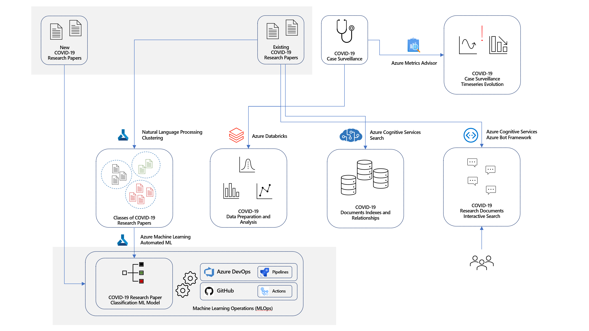

## Task 3 - Observe the execution and artifacts of the existing model training Azure DevOps pipeline

1. Open the [Azure DevOps portal](https://dev.azure.com/) and select the **Sign in to Azure DevOps** link.

    

2. To sign-in, use the Azure credentials provided by the lab environment.

3. In Azure DevOps, open the pre-created project named `odluserXXXXXX-project` and navigate to the **Pipelines** section and observe the two pipelines pre-created for you: `Model-Train-Register-CI` and `Model-Deploy-CD`.

    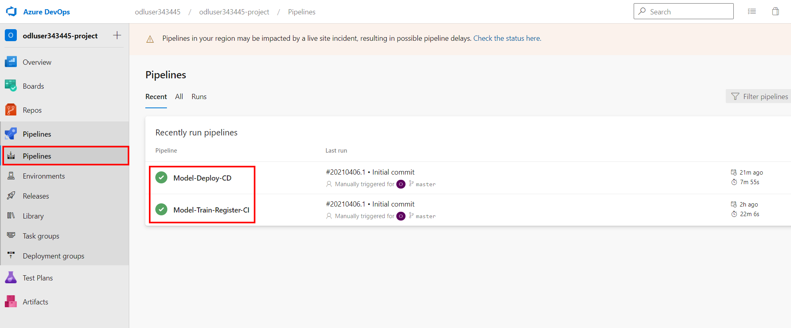

4. Select the `Model-Train-Register-CI` pipeline and then select the first run as illustrated in the picture bellow.

    

5. On the run results page, check the **Summary** section to understand how the pipeline is linked to GitHub. Right click on the repository name on the Repository and version column as illustrated bellow and choose to open it in a new tab.

    

6. You will be prompted to sign in with the Git credentials provided for you in the lab environment.

7. You will be asked to verify your account, so you should open your user's mailbox on https://outlook.office365.com/ to be able to receive the verification codes for GitHub authentication. Use the same GitHub user account credentials to open Outlook.

8. In GitHub, you will see the `azure-ai-in-a-day-lab02` repository that was pre-generated under your GitHub account.

    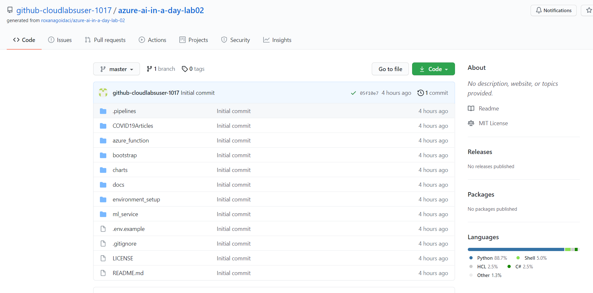

9. If the repository is not automatically opened, please select it from the available repositories list.

    

10. Spend a few moments to browse the repository structure. Focus on the `.pipelines` folder which contains the YAML  scripts used by the Azure DevOps pipelines discussed later in this exercise.

    

11. Going back to the Azure DevOps portal browser tab, on the `Model-Train-Register-CI` pipeline run page observe the two stages of the CI pipeline. Select the **Model CI** stage to open the execution log for this pipeline run.

    

12. Select the **Publish Azure Machine Learning Pipeline** task node under **Model CI Pipeline**. Scroll down on the execution log window and observe the publishing of the Azure Machine Learning pipeline.The AML pipeline involves three main steps: Train, Evaluate and Register model.

    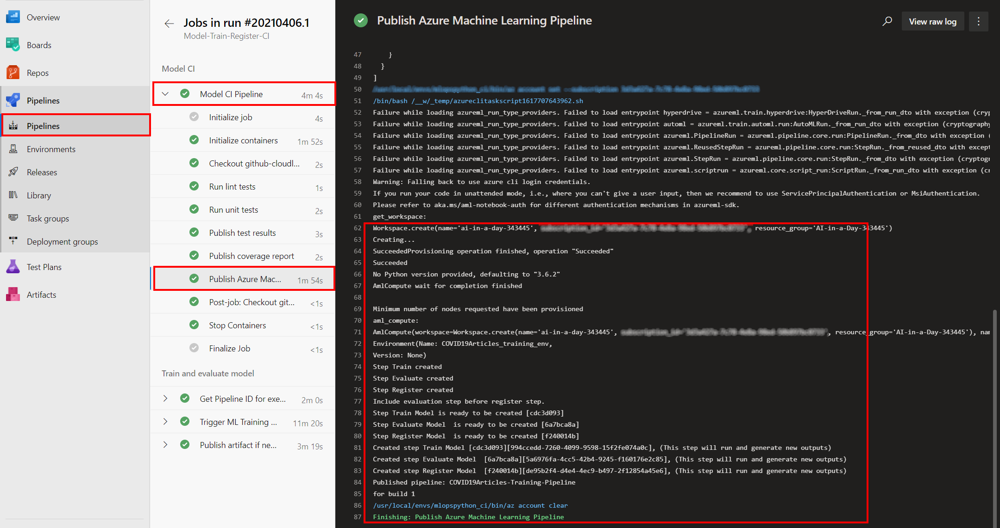

13. Going back to the pipeline stages page, expand the **Train and evaluate model stage** from the **Expand stage** button.

    

14. Also you should inspect the artifact of the training stage:

    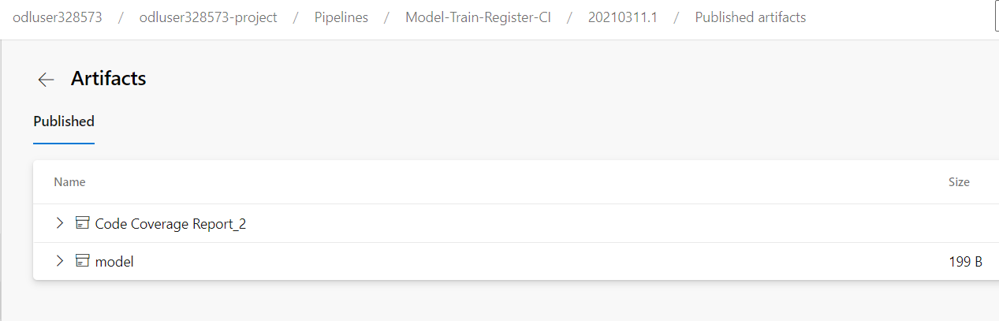

15. Going back to the pipeline stages page, select the **Train and evaluate model stage** to open the run execution log.

    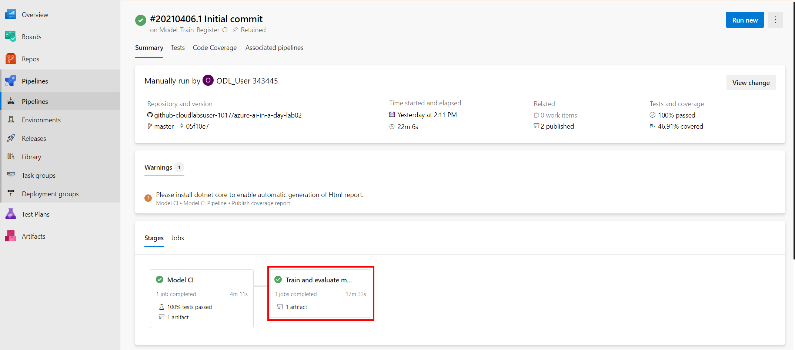

16. Expand the **Train and evaluate model** task nodes and observe the three main tasks involved in this stage: **Get pipeline ID for execution**, **Trigger ML Training Pipeline** and **Publish artifact is new model was registered**.

    

17. To be able to understand the artifacts published in your Azure Machine Learning Workspace, open a new browser tab and sign in to the [Azure Portal](https://portal.azure.com) with the Azure credentials provided in the lab. Open the available Resource Group, locate and select the Machine Learning workspace that was pre-created in the lab environment.

    

18. Select **Launch studio** to navigate to the **Azure Machine Learning Studio**.

19. In the [Azure Machine Learning Studio](https://ml.azure.com), select **Pipelines** from the left navigation menu, go to **Pipeline endpoints** and check the published training pipeline in the `ai-in-a-day-XXXXXX` workspace.

    

20. The build pipeline for training automatically triggers every time there's a change in the master branch. After the pipeline is finished, you'll see a new model in the ML Workspace. Navigate to the **Models** section in [ML Studio](https://ml.azure.com/), using the left navigation menu and check the  registered model named `COVID19Articles_model.pkl`.

     

## Task 4 - Explore the execution of the existing  Azure DevOps release pipeline

The release deployment and batch scoring pipelines have the following behaviors:

- The pipeline will automatically trigger on completion of the Model-Train-Register-CI pipeline for the master branch.
- The pipeline will default to using the latest successful build of the Model-Train-Register-CI pipeline. It will deploy the model produced by that build.
- You can specify a Model-Train-Register-CI build ID when running the pipeline manually. You can find this in the url of the build, and the model registered from that build will also be tagged with the build ID. This is useful to skip model training and registration, and deploy/score a model successfully registered by a Model-Train-Register-CI build.

    >The pipeline has the following stages:
    >
    >- Deploy to ACI
    >
    >   - Deploy the model to the QA environment in Azure Container Instances.
    >
    >   - Smoke test: scoring sample step

1. In Azure DevOps, open your project and navigate to the **Pipelines** section. Select the `Model-Deploy-CD` pipeline and then select the first run as illustrated in the picture bellow.

    

2. The first time when the CD pipeline runs, it will use the latest model created by the Model-Train-Register-CI pipeline. Given that the pre-created pipeline has already finished the first execution, check the displayed execution stages as illustrated bellow.

    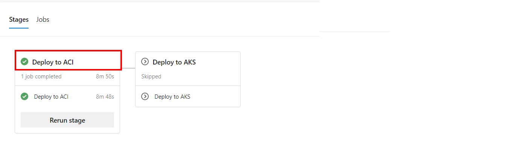
  
3. Select the first stage: Deploy to ACI to open the execution log. Expand the list of executed tasks under the stage node. Select the **Parse Json for Model Name and Version** task. You can see how the model name and version are downloaded from the `Model-Train-Register-CI` pipeline.

    

4. Select the **Deploy to ACI (CLI)** node and scroll the execution log to see the performed steps inside the deployment task.

    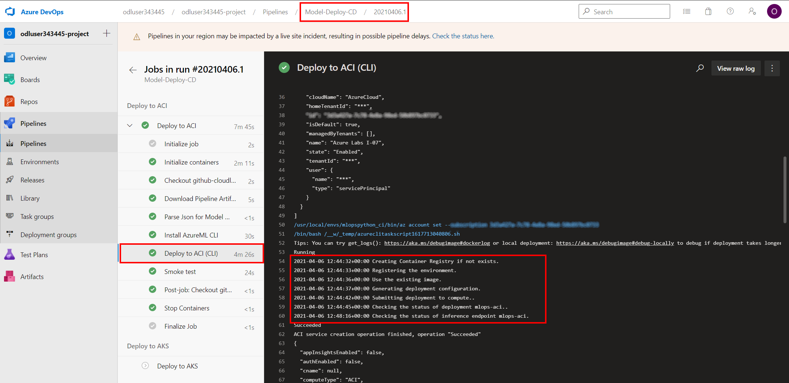

5. Select the **Smoke test**: The test sends a sample query to the scoring web service and verifies that it returns the expected response. Have a look at the smoke [test code](https://github.com/solliancenet/azure-ai-in-a-day-lab-02-starter/blob/master/ml_service/util/smoke_test_scoring_service.py) for more details on the steps involved there.

    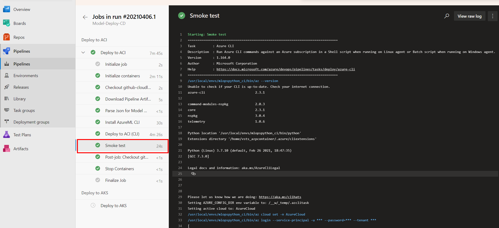

6. To be able to understand the artifacts published in your Azure Machine Learning Workspace, go back to the Azure Machine Learning Studio page already opened in your browser and move directly to step 8. If you don't find ML Studio opened from the previous task, open a new browser tab and sign in to the [Azure Portal](https://portal.azure.com) with the Azure credentials provided in the lab. Open the available Resource Group, locate and select the Machine Learning workspace that was pre-created in the lab environment.

    

7. Select **Launch studio** to navigate to the **Azure Machine Learning Studio**.

8. In the [Azure Machine Learning Studio](https://ml.azure.com), select **Endpoints** (1) from the left navigation menu, go to **Real-time endpoints** (2) and select the published ACI endpoint named `mlops-aci` (3).

    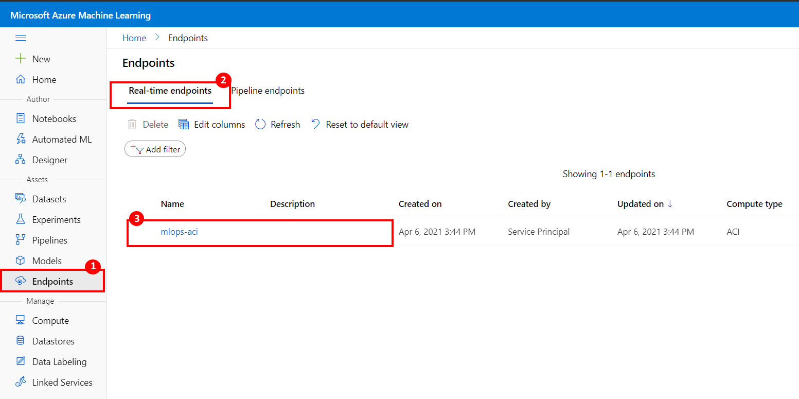

9. When opening the ACI endpoint details page, you can identify the REST endpoint used for scoring in the Smoke test example on step 5 of this Task.

    

## Task 5 - Explore the manual validation option in Azure DevOps Pipelines

In Azure DevOps Pipelines, teams can also take advantage of the Approvals and Gates feature to control the workflow of the deployment pipeline. Each stage in a release pipeline can be configured with pre-deployment and post-deployment conditions that can include waiting for users to manually approve or reject deployments, and checking with other automated systems that specific conditions are met.

1. Open the [Azure DevOps portal](https://dev.azure.com/) and if not already signed in, select the **Sign in to Azure DevOps** link. (To sign-in, use the Azure credentials provided by the lab environment.)

2. In Azure DevOps, open the pre-created project named `odluserXXXXXX-project`, navigate to the **Pipelines** section and observe the two pipelines pre-created for you: `Model-Train-Register-CI` and `Model-Deploy-CD`. Select the **Model-Train-Register-CI** pipeline.

    

3. Select **Edit** to open the pipeline designer.

    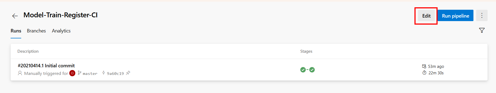

4. In the pipeline YAML definition, locate the end of the job `Model_CI_Pipeline` (should be line 46). Add a new, empty line and then insert the following snippet (make sure to replace `odl_user_XXXXXX` with the actual user name assigned to your environment):

    ```yml
    - job: "Validate_Code_Quality"
        dependsOn: "Model_CI_Pipeline"
        displayName: "Validate code quality"
        timeoutInMinutes: 15
        pool: server
        steps:
        - task: ManualValidation@0
        timeoutInMinutes: 10
        inputs:
            notifyUsers: |
            odl_user_XXXXXX@msazurelabs.onmicrosoft.com
            instructions: 'Please validate the code quality analysis results and resume.'
            onTimeout: reject
    ```

    After performing the changes, your YAML code should look similar to this:

    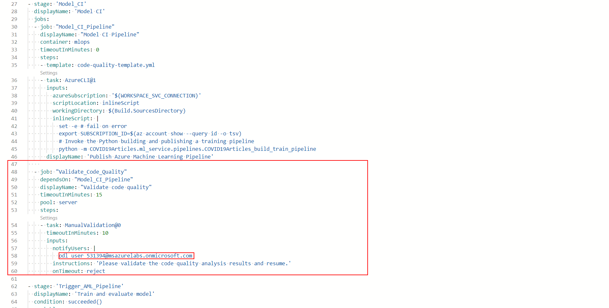

5. **Save** and **Run** the pipeline. Select the new pipeline Run from the **Runs** list and check the status of the `Model CI` stage. Wait until the `Model CI Pipeline` job completes and then notice the `Review` popup that appears when the `Validate code quality` job starts executing. Select `Review` to perform the manual intervention.

    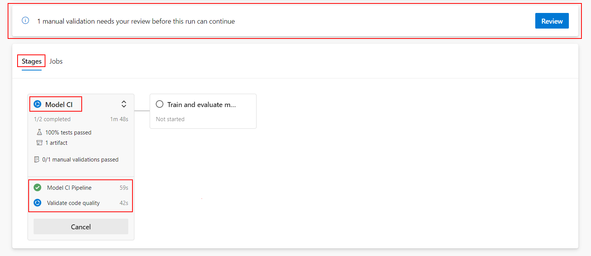

6. Notice the timeout indication at the top of the `Manual Validation` popup. Select `Resume` to allow the pipeline execution to continue.

    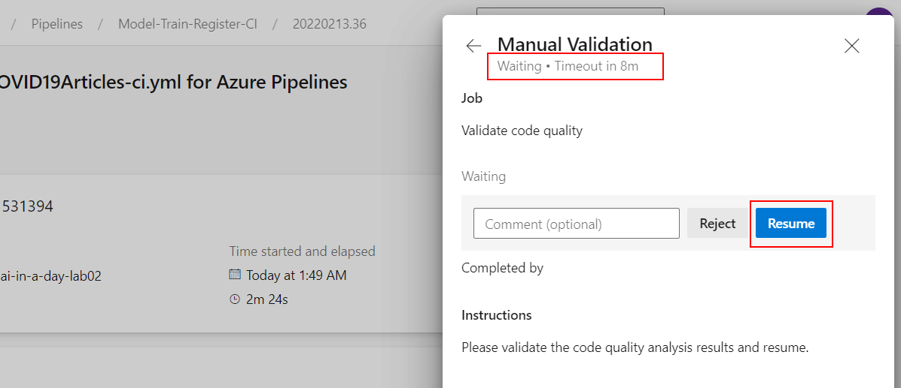

**/OPTIONAL_ACTION**

## Task 6 - Explore the execution of the existing GitHub actions workflow

Github workflows are triggered based on events specified inside workflows. These events can be from inside the github repo like a push commit or can be from outside like a webhook.
We have created sample workflow file train_deploy.yml to train the model and deploy the ACI endpoint, similar to what we did in the previous exercise using DevOps Pipelines. This GitHub workflow trains the model in a first job and, on successful training completion, deploys the model inside the second job. You will activate this workflow by doing a commit to any file under the included path: `COVID19Articles_GH/` folder.

1. Sign-in to [GitHub](https://github.com) with your GitHub account.

2. Navigate to the already generated repository for this lab, named `azure-ai-in-a-day-lab02`. If the repository is not automatically opened, please select it from the available repositories list.

    .

3. Navigate to the `.github/workflows` folder and open the train_deploy.yml **(1)** workflow definition file . Observe the two jobs defined for the GitHub Actions workflow: **train-register** and **deploy** **(3)**. The workflow is triggered when a code change is committed inside the **COVID19Articles_GH** repository folder or the `master` branch **(2)**.

   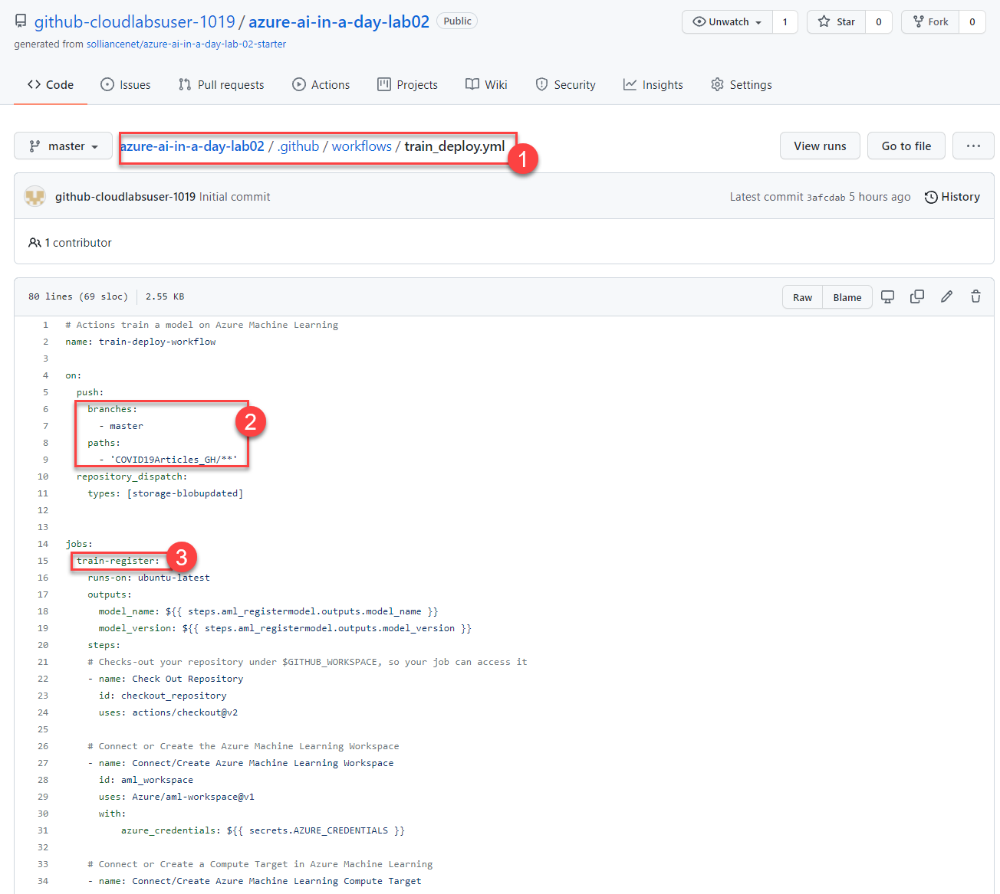

4. With the repository opened, select the **Actions** section from the top navigation menu. Observe the active workflow that was already initiated at the first code commit, when the `.github/workflows/train_deploy.yml` definition file was initially created in the repository.

   

5. Going back to the repository files, open the **COVID19Articles_GH/train** folder and select the `train_aml.py` code file. 

    

6. Open the `train_aml.py` code file in edit mode.

    

7. Go to line 172 and change the `max_depth` argument value from **5** to **4** (1). Commit your change (2).

    

8. Navigate to the **Actions** section in GitHub and observe how your code change automatically triggered the GitHub Action train-deploy-workflow. Select the workflow run.

    

9. Observe the two jobs of the workflow run. Select each stage and check the job steps in the execution log.

    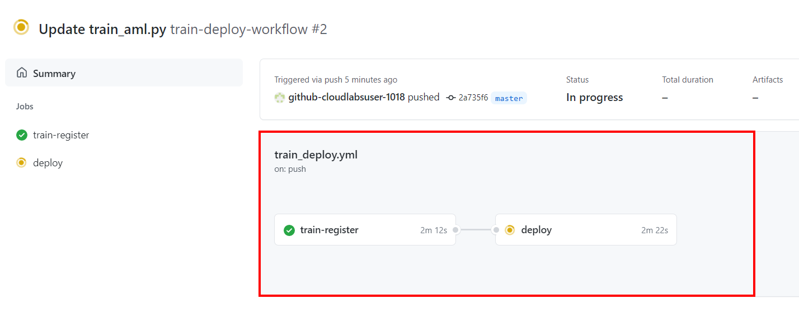

10. While waiting for the workflow to execute, watch it how it moves from the first job to the second one and switch back to the [Azure Machine Learning Studio page](https://ml.azure.com/) to see the generated artifacts of each step: register dataset, submit experiment, register model and deploy ACI endpoint.

11. Navigate to the **Experiments** section (1). You should be able to see the new experiment **COVID19_Classification_GH** (2) that was started by the GitHub Actions Workflow you triggered. Expand the experiment to see the created experiment Run.

    

12. Navigate to the **Models** (1) page. You should be able to see the model registered by the GitHub Actions workflow, named **COVID19Articles_githubactions** (2).

    

13. Check the deploy job execution log while it is executing. When the deploy stage completes, in ML Studio, navigate to the **Endpoints** (1) page. You should be able to see the ACI endpoint named `mlops-aci-githubactions` (2) published inside the GH Actions `deploy` job.

    

    


## Task 7 - Trigger the MLOPS Pipeline when training data changes

In the Azure Portal, we prepared an Azure Function that triggers the above described GitHub workflow every time a new version of the COVID16Articles.csv file is uploaded in the datastore. 

1. Open the [Azure portal](https://portal.azure.com/) and sign-in using the Azure credentials provided by the lab environment. 

2. From the left navigation menu, select the **Storage accounts** option and locate the storage named `mlstrgXXXXXX` as illustrated bellow. 
   
    

3. Select `mlstrgXXXXXX` storage account and select **Containers** from the account Overview page.

    

4. Select the `azureml-blobstore-...` container. This is the storage container linked to the default **Datastore** used by Azure Machine Learning Workspace.

    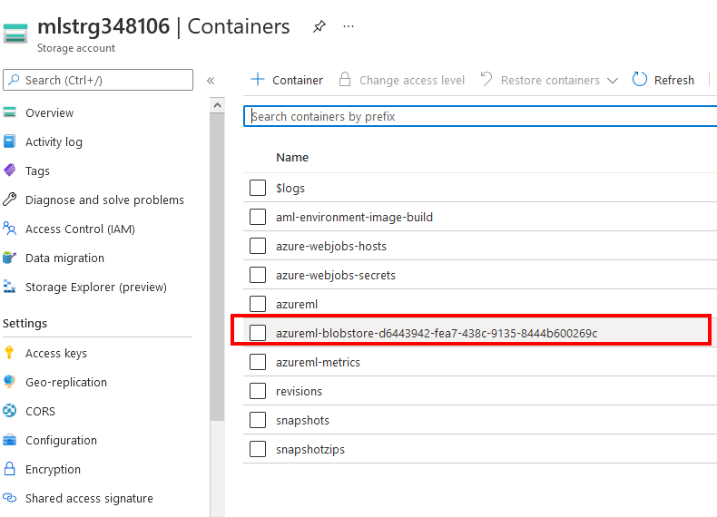

5. Navigate to the `training-data\COVID19Articles.csv` file. Download it to your computer and change anything inside the file.

6. Upload the new version of COVID19Articles.csv in the same `training-data` folder by using the Upload button from the top menu bar.

    

7.Select the option to overwrite the file since it already exists in the container.

   

8. Open the GitHub portal, select the `azure-ai-in-a-day-lab-02` repository and select **Actions** from the top menu bar. Notice how the data file update triggered your GitHub Actions workflow execution.
   
    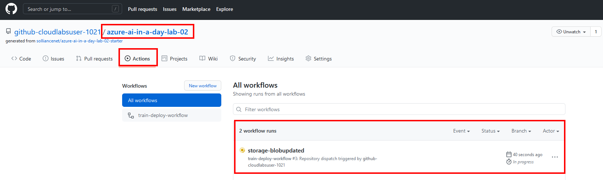
