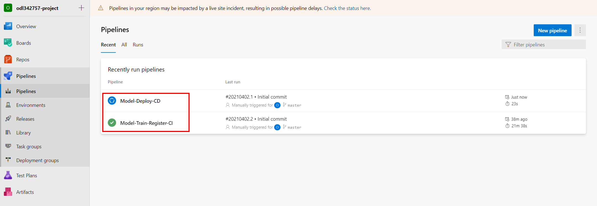
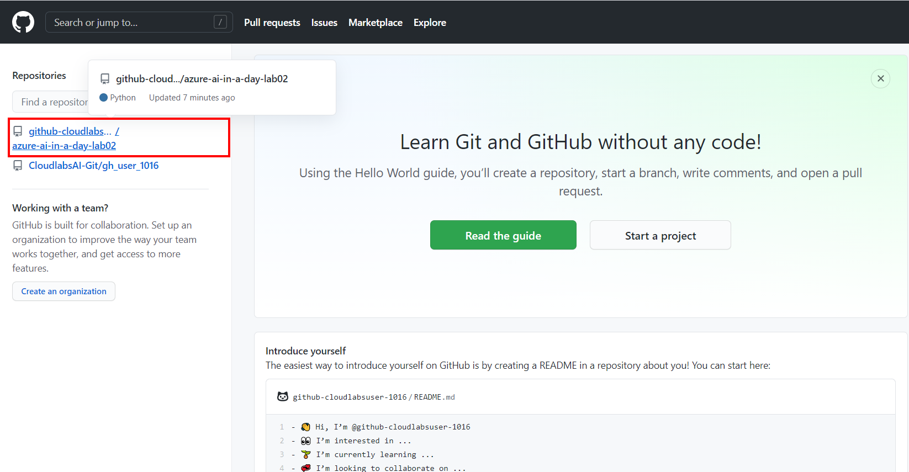
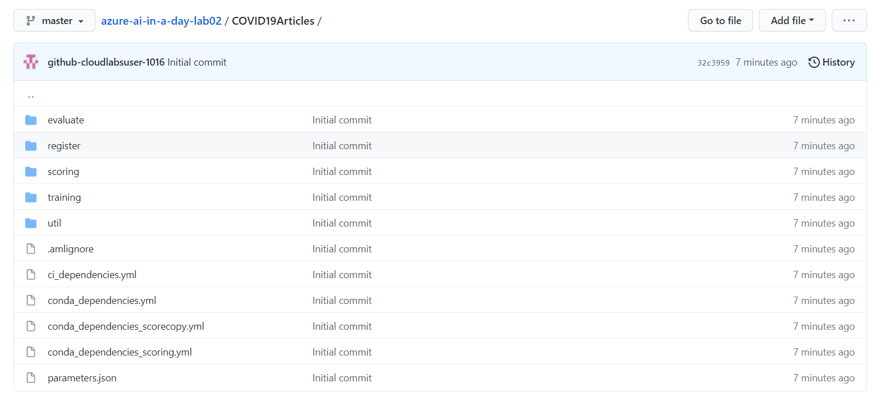

# Lab 2 - Azure Machine Learning Model Operationalization

This lab covers MLOps using Azure DevOps and GitHub, training and deployment of models, real time scoring using a REST API endpoint.

The high-level steps covered in the lab are:
- Explore dashboard of COVID-19 data
- Explore lab scenario
- Observe the execution of CI/CD pipeline all the way to the update on the REST API endpoint
- Understand the artifacts created by the CI component of the pipeline: AML workspace with notebooks, experiments, and data
- Using GitHub actions to trigger CI/CD pipeline by committing a simple code change
- Keep gates within Azure Pipeline to pre-empt the triggers before the pipeline moves stages
- Approve changes after validation to see it move stages
- Repeat previous steps with data drift triggers

## Task 1 - Explore dashboard of COVID-19 data

Understanding the source datasets is very important in AI and ML. To help you expedite the process, we have created a Power BI dashboard you can use to explore them at the begining of each lab.

To get more details about the source datasets, check out the [Data Overview](../data-overview.md) section.

To explore the dashboard of COVID-19 data, open the `Azure-AI-in-a-Day-Data-Overview.pbix` file located on the desktop of the virtual machine provided with your environment.

## Task 2 - Explore lab scenario

Managing a virtually non-stop flux of incoming research documents should be based on a fully automated and traceable process. Everything from data to code must be tracked and monitored. The complex processes of Machine Learning model training and operationalization require secure, end-to-end approaches that allow teams of developers and analysts to iterate through multiple versions of the solution.

Using GitHub and GitHub Actions, we will build an end-to-end Machine Learning process, where data and code act like inputs and actionable REST API endpoints are the result. Our pipelines will automate building and operationalizing the Machine Learning model that classifies research papers.

The following diagram highlights the portion of the general architecture covered by this lab.

## Task 3 - Observe the execution of the existing CI/CD pipelines

1. Open the [Azure DevOps portal](https://dev.azure.com/) and select the **Sign in to Azure DevOps** link.

    

2. To sign-in, use the Azure credentials provided by the lab environment.

3. In Azure DevOps, open the pre-created project named `odluserXXXXXX-project` and navigate to the **Pipelines** section and observe the two pipelines pre-created for you: `Model-Train-Register-CI` and `Model-Deploy-CD`.

    

4. Let's now explore the GitHub repository that the pre-created CI/CD pipelines are based on. First, Go to the [GitHub portal](https://github.com/) and sign in with the Git credentials provided for you.
5. You will be asked to verify your account, so you should open your user's mailbox on https://outlook.office365.com/ to be able to receive the verification codes for GitHub authentication. Use the same GitHub user account credentials to open Outlook.
6. In GitHub, select the `azure-ai-in-a-day-lab02` repository that was pre-generated under your GitHub account. 

    

7. Spend a few moments to browse the repository structure explained in detail [here](https://github.com/solliancenet/azure-ai-in-a-day-lab-02-starter/blob/master/docs/code_description.md). Focus on the `COVID19Articles` folder which contains all the scripts involved in the Azure DevOps pipeline discussed in this exercise.

    

## Task 4 - Explore the artifacts of the CI pipeline

1.  Once the pipeline is finished, check the execution result. Expand the **Train and evaluate model stage** from the **Expand stage** button.
    
    

2. Also you should inspect the artifact of the training stage:
   
    

3. Next, open a new browser tab and sign in to the [Azure Portal](https://portal.azure.com) with the Azure credentials provided in the lab. Open the available Resource Group, locate and select the Machine Learning workspace that was pre-created in the lab environment.
   
    

4. Select **Launch studio** to navigate to the **Azure Machine Learning Studio**.

5. In the [Azure Machine Learning Studio](https://ml.azure.com), select **Pipelines** from the left navigation menu, go to **Pipeline endpoints** and check the published training pipeline in the `ai-in-a-day-XXXXXX` workspace.
   
    

6.  The build pipeline for training automatically triggers every time there's a change in the master branch. After the pipeline is finished, you'll see a new model in the ML Workspace. Navigate to the **Models** section in [ML Studio](https://ml.azure.com/), using the left navigation menu and check the  registered model named `COVID19Articles_model.pkl`.
    
     

## Task 4 - Explore the release pipeline artifacts

The release deployment and batch scoring pipelines have the following behaviors:

 - The pipeline will automatically trigger on completion of the Model-Train-Register-CI pipeline for the master branch.
 - The pipeline will default to using the latest successful build of the Model-Train-Register-CI pipeline. It will deploy the model produced by that build.
 - You can specify a Model-Train-Register-CI build ID when running the pipeline manually. You can find this in the url of the build, and the model registered from that build will also be tagged with the build ID. This is useful to skip model training and registration, and deploy/score a model successfully registered by a Model-Train-Register-CI build.

1. The first time when the CD pipeline runs, it will use the latest model created by the Model-Train-Register-CI pipeline. Once the pipeline is finished, check the execution result.

    

2. Once your pipeline run begins, you can see the model name and version downloaded from the `Model-Train-Register-CI` pipeline.

    

The pipeline has the following stages:

- Deploy to ACI
    - Deploy the model to the QA environment in Azure Container Instances.
    - Smoke test
        - The test sends a sample query to the scoring web service and verifies that it returns the expected response. Have a look at the smoke [test code](https://github.com/solliancenet/azure-ai-in-a-day-lab-02-starter/blob/master/ml_service/util/smoke_test_scoring_service.py) for an example.