# Lab 2 - Azure Machine Learning Model Operationalization

This lab covers MLOps using Azure DevOps and GitHub, training and deployment of models, real time scoring using a REST API endpoint.

## Task 1 - Explore dashboard of COVID-19 data

Understanding the source datasets is very important in AI and ML. To help you expedite the process, we have created a Power BI dashboard you can use to explore them at the begining of each lab.

To get more details about the source datasets, check out the [Data Overview](../data-overview.md) section.

To explore the dashboard of COVID-19 data, open the `Azure-AI-in-a-Day-Data-Overview.pbix` file located on the desktop of the virtual machine provided with your environment.

## Task 2 - Explore lab scenario

Managing a virtually non-stop flux of incoming research documents should be based on a fully automated and traceable process. Everything from data to code must be tracked and monitored. The complex processes of Machine Learning model training and operationalization require secure, end-to-end approaches that allow teams of developers and analysts to iterate through multiple versions of the solution.

Using GitHub and GitHub Actions, we will build an end-to-end Machine Learning process, where data and code act like inputs and actionable REST API endpoints are the result. Our pipelines will automate building and operationalizing the Machine Learning model that classifies research papers.

The following diagram highlights the portion of the general architecture covered by this lab.

The high-level steps covered in the lab are:

- Explore dashboard of COVID-19 data
- Explore lab scenario
- Overview of CI/CD pipeline
- Perform real time scoring on a REST API endpoint published by the CD component of the pipeline
- Trigger CI/CD pipeline by committing a simple code change
- Monitor execution of CI/CD pipeline all the way to the update on the REST API endpoint
- Perform another real time scoring on the REST API endpoint
- Explore aspects related to traceability and control of the process

## Task 3 - Configure the Azure DevOps project and required Variable group

1. Open the [Azure DevOps portal](https://dev.azure.com/) and select the **Sign in to Azure DevOps** link.
   
    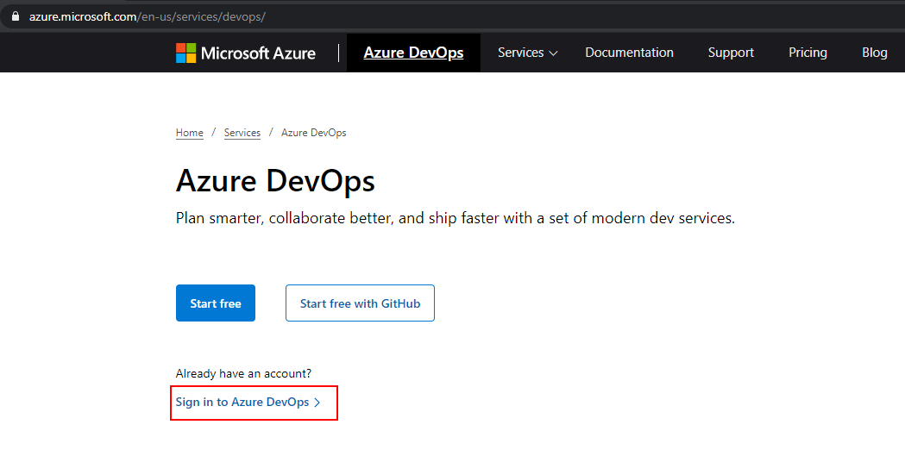

2. To sign-in, use the Azure credentials provided by the lab environment.
   
3. First time you sign-in to your Azure DevOps account, you are asked to create a new project in the pre-created organization you have available, named `odluserXXXXXX`. Provide the project name in the following form `odluserXXXXXX-project` and select **+ Create project**
   
   

4. MLOpsPython requires some variables to be set before you can run any pipelines. At this step, you'll create a variable group in Azure DevOps to store values that are reused across multiple pipeline stages. Navigate to **Pipelines**, **Library** and in the **Variable groups** section select **+ Variable group** as indicated bellow.

   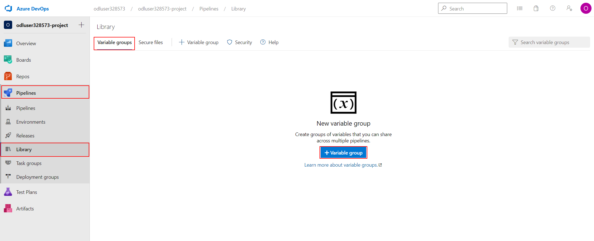

5. To prepare the values you'll need to set all your variables, you need to get the resource group location where all your Azure resources were provisioned. In another browser tab, navigate to the [Azure portal](https://portal.azure.com), sign in with the provided Azure credentials if you are asked to, and navigate to the lab Resource group. On the resourge group overview page, you'll find the location information you need.
   
      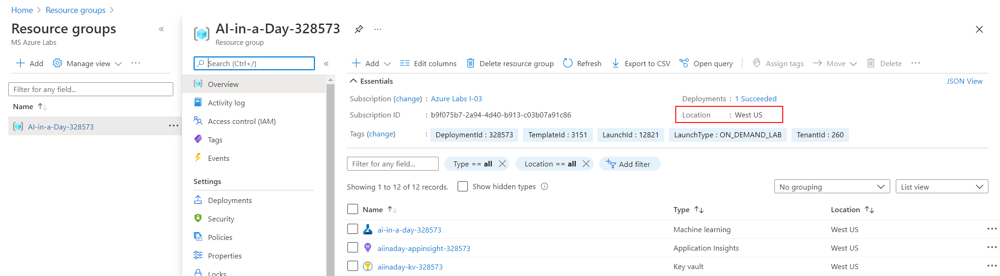

6. Going back to the Azure Devops portal where you created the Variable group for you DevOps project, enter the **Variable group name**: `devopsforai-aml-vg`.
   
7. Add the required list of variables, using the **+ Add** link at the bottom of the **Variables** section as illustrated in the image bellow:

    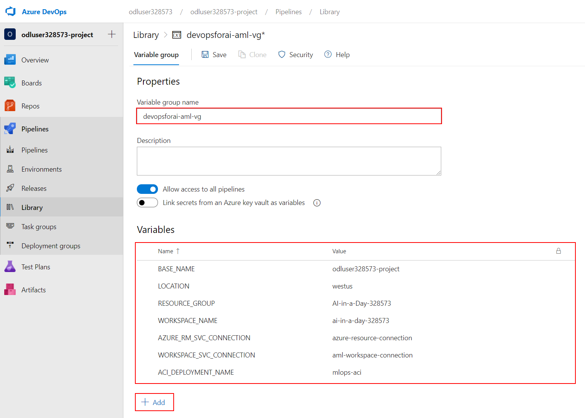

    Use values listed in the table:

    | Variable Name            | Suggested Value           | Short description                                                                                                           |
    | ------------------------ | ------------------------- | --------------------------------------------------------------------------------------------------------------------------- |
    | BASE_NAME                | [your project name] e.g. `odluserXXXXXX-project`     | Unique naming prefix for created resources - max 10 chars, letters and numbers only                                         |
    | LOCATION                 | `westus`                 | Resource group location (the value you looked for on the previous step)                             |
    | RESOURCE_GROUP           | `AI-in-a-Day-XXXXXX`                | Azure Resource Group name                                                                                                   |
    | WORKSPACE_NAME           | `ai-in-a-day-XXXXXX`             | Azure ML Workspace name                                                                                                     |
    | AZURE_RM_SVC_CONNECTION  | `azure-resource-connection` | [Azure Resource Manager Service Connection](#create-an-azure-devops-service-connection-for-the-azure-resource-manager) name |
    | WORKSPACE_SVC_CONNECTION | `aml-workspace-connection`  | [Azure ML Workspace Service Connection](#create-an-azure-devops-azure-ml-workspace-service-connection) name                 |
    | ACI_DEPLOYMENT_NAME      | `mlops-aci`                 | [Azure Container Instances](https://azure.microsoft.com/en-us/services/container-instances/) name                           |                 |

8. Make sure you select the **Allow access to all pipelines** checkbox in the variable group configuration.

    

9. Select **Save** from the top menu to create the variable group.

    

## Task 4 - Create an Azure DevOps Service Connection for the Azure ML Workspace

Create a new service connection to your Azure ML Workspace to enable executing the Azure ML training pipeline. The connection name needs to match WORKSPACE_SVC_CONNECTION that you set in the variable group above (eg. `aml-workspace-connection`).

1. Go to **Project settings**, **Service connections** and select **Create service connection** as illustrated bellow.

    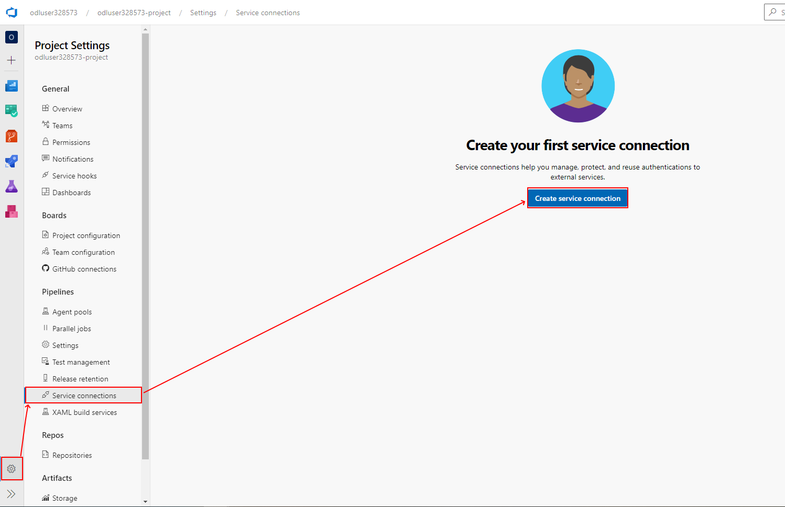

2. Select the connection type from the available list: **Azure Resource Manager** and select **Next**.

    

3. Provide the authentication method: **Service principal (automatic)** and move **Next**.
    

4. Select scope level: **Machine Learning Workspace** and select the available **Subscription**, **Resource group** and **Machine Learning Workspace** provided in the lab environment. Enter `aml-workspace-connection` for the **Service connection name** and select **Save**.

    
    
Note: Creating a service connection with Azure Machine Learning workspace scope requires 'Owner' or 'User Access Administrator' permissions on the Workspace. You'll need sufficient permissions to register an application with your Azure AD tenant, or you can get the ID and secret of a service principal from your Azure AD Administrator. That principal must have Contributor permissions on the Azure ML Workspace.

## Task 5 - Import the github repository

1. Go to the [GitHub portal](https://github.com/) and sign in with the Git credentials provided for you.
2. You will be asked to verify your account, so you should open your user's mailbox on https://outlook.office365.com/ to be able to receive the verification codes for Github authentication. Use the same Github user account credentials to open Outlook.
   
3. In Github, while authenticated with the lab user, navigate to the following link to create a new git repository from the provided template:
   https://github.com/solliancenet/azure-ai-in-a-day-lab-02-starter/generate

4. Set the repository name to `azure-ai-in-a-day-lab02` and select **Create repository from template**.

5. When the new repository is generated, copy your repository URL from the browser address bar since you will need it in the next steps.
   
6. Back to the project **Overview** page in Azure DevOps, navigate to the **Repos** section from the left navigation menu. Select **Import** for the **Import a repository** option.

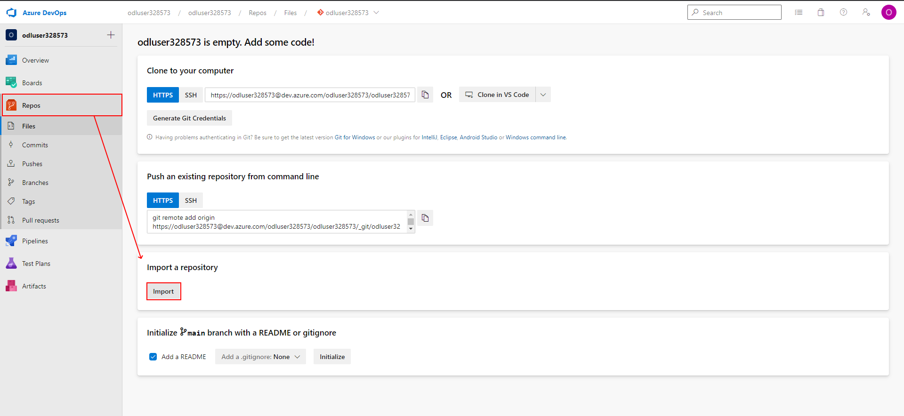

7. In the **Clone URL** paste the URL of the repository generated on step 4. The URL should look like this:
  `https://github.com/<GitAccountName>/azure-ai-in-a-day-lab02`. Select **Import** to start the import process.

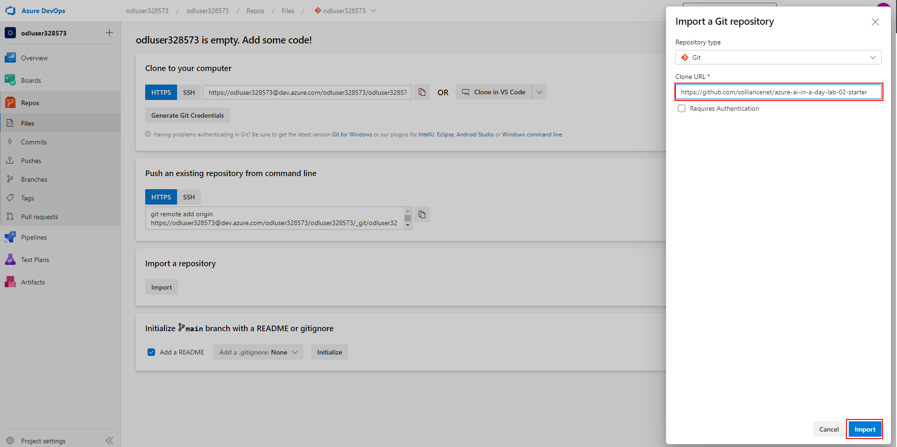

## Task 6 - Install the Azure Machine Learning extension

1. Next we'll install the Azure Machine Learning extension that contains the Azure ML pipeline tasks and adds the ability to create Azure ML Workspace service connections. In Azure DevOps, navigate to the organization page, by selecting it from the left menu and then select **Organization settings** from the bottom left corner of the page.

2. Navigate to the **Extensions** section from the left menu. If the Machine Learning extension is already installed, proceed to the next task in the exercise. Otherwise hit **Browse marketplace** in the right corner of the page. 

3. Search for `machine learning` on the marketplace page and select the Machine Learning extension as illustrated bellow.

4. Select **Get it free** to move to the installation page.

5. Select the current organization name and proceed to the installation.

6. When the installation is complete, select **Proceed to organization** to return to the main organization page and return to your project.
   

## Task 7 - Set up Build, Release Trigger, and Release Multi-Stage Pipelines

Now that you've provisioned all the required Azure resources and service connections, you can set up the pipelines for training (CI) and deploying (CD) your machine learning model to production. Additionally, you can set up a pipeline for batch scoring.
In the following steps you will create and run a new build pipeline based on the `diabetes_regression-ci.yml` pipeline definition in your imported repository.
   
1. In your Azure DevOps project summary page, navigate to the **Pipelines** section from the left navigation menu. Select **Create Pipeline**.

2. Select the code location: **Azure Repos Git**.
   

3. Select the Git repository imported in the previous task: `odlXXXXXX-project`.
   

4. In the **Configure pipeline** step, select the **Existing Azure Pipelines YAML file**.
   
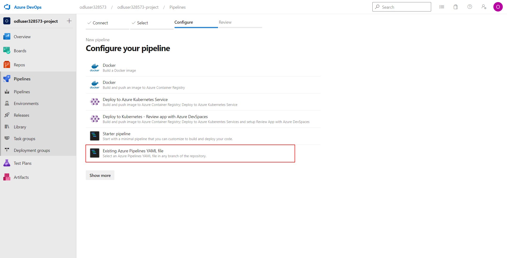

5. Leave the default branch selected and paste the path to the YAML file: `/.pipelines/diabetes_regression-ci.yml'. Select **Continue**.

6. In the **Review** step, take a moment to observe the code inside the YAML file and then expand the **Run** menu and select **Save**.
   
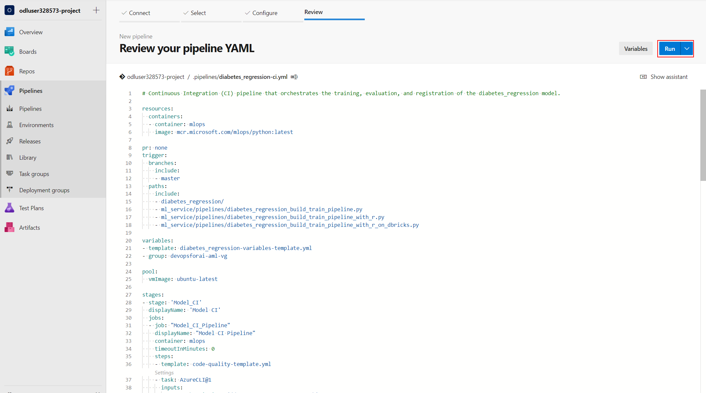

7. With the created pipeline, select **Rename/move** from the right menu as illustrated bellow:

8. Change the pipeline name to: `Model-Train-Register-CI` and select **Save**.

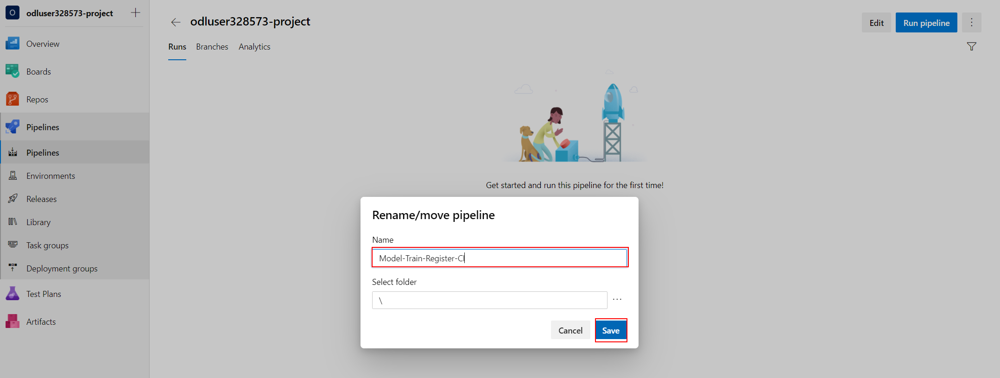

9. Run the pipeline by selecting the **Run pipeline** button. Leave the default values on the next dialog and hit **Run**. Wait for the pipeline run to complete (it can take up to 20-25 minutes for the pipeline to finish).

10.  Once the pipeline is finished, check the execution result. Expand the **Train and evaluate model stage** from the **Expand stage** button. 
    

11. Also you should inspect the artifact of the training stage:

12. Next, open a new browser tab and sign in to the [Azure Portal](https://portal.azure.com) with the Azure credentials provided in the lab. Open the available Resource Group, locate and select the Machine Learning workspace that was pre-created in the lab environment.
    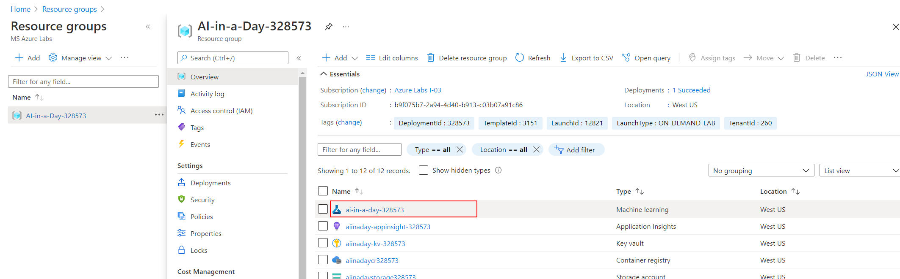

13. Select **Launch studio** to navigate to the **Azure Machine Learning Studio**.
    
14.  In the [Azure Machine Learning Studio](https://ml.azure.com), select **Pipelines** from the left navigation menu, go to **Pipeline endpoints** and check the published training pipeline in the `ai-in-a-day-XXXXXX` workspace.
    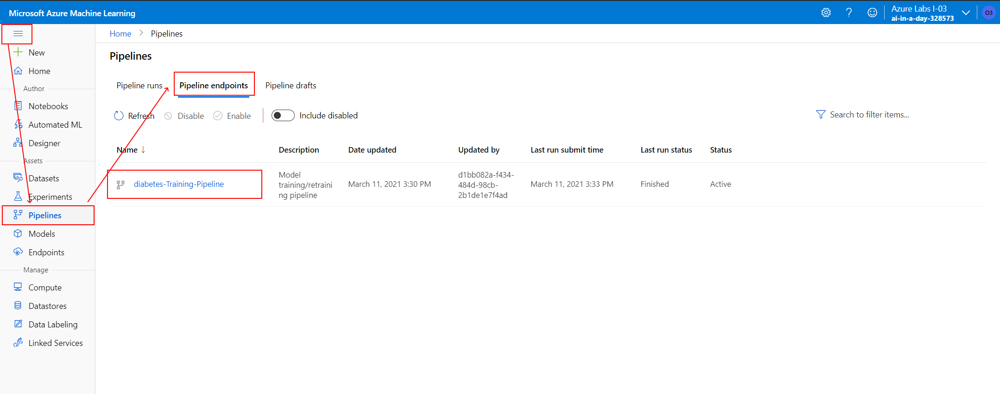

Great, you now have the build pipeline for training set up which automatically triggers every time there's a change in the master branch! After the pipeline is finished, you'll see a new model in the ML Workspace.

15. Navigate to the **Models** section in ML Studio, using the left navigation menu and check the newly registered model named `diabetes_regression_model.pkl`.
    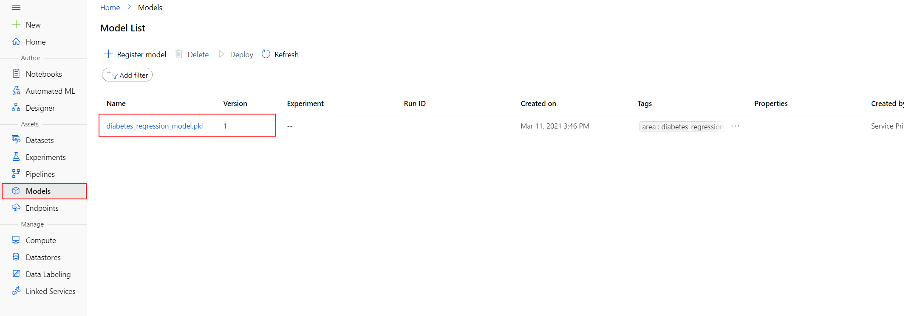

## Task 8 - Set up the Release Deployment pipeline

The release deployment and batch scoring pipelines have the following behaviors:

 - The pipeline will automatically trigger on completion of the Model-Train-Register-CI pipeline for the master branch.
 - The pipeline will default to using the latest successful build of the Model-Train-Register-CI pipeline. It will deploy the model produced by that build.
 - You can specify a Model-Train-Register-CI build ID when running the pipeline manually. You can find this in the url of the build, and the model registered from that build will also be tagged with the build ID. This is useful to skip model training and registration, and deploy/score a model successfully registered by a Model-Train-Register-CI build.

1. Open the Azure DevOps portal and sign in with the Azure credentials provided for you in the lab environment.
2. In your current organization, open the Azure DevOps project summary page and navigate to the **Pipelines** section from the left navigation menu. Select **New Pipeline**.

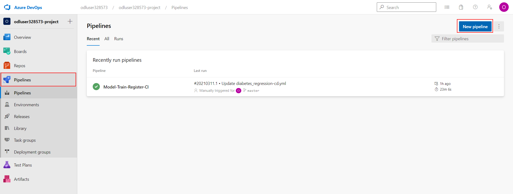

3. Select the code location: **Azure Repos Git**.
   

4. Select the Git repository imported in the previous task: `odlXXXXXX-project`.
   

5. In the **Configure pipeline** step, select the **Existing Azure Pipelines YAML file**.
   

6. Leave the default branch selected and paste the path to the YAML file: `/.pipelines/diabetes_regression-cd.yml'. Select **Continue**.

7. In the **Review** step, take a moment to observe the code inside the YAML file and then expand the **Run** menu and select **Save**.
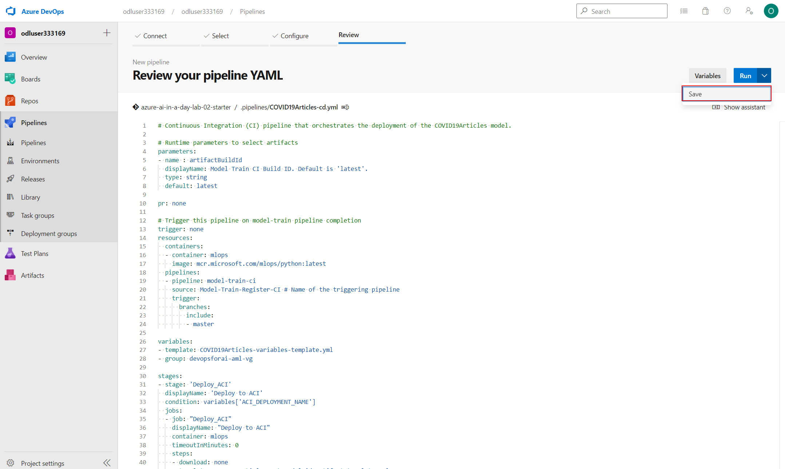

8. With the created pipeline, select **Rename/move** from the right menu as illustrated bellow:

9. Change the pipeline name to: `Model-Deploy-CD` and select **Save**.

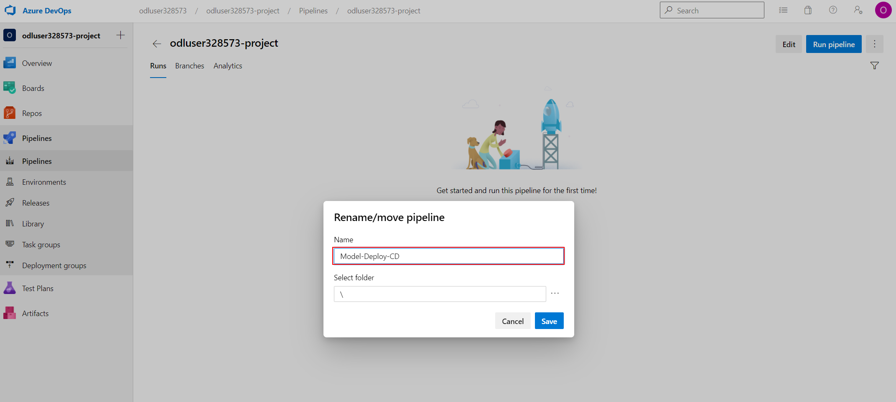

10. Run the pipeline by selecting the **Run pipeline** button. Leave the default values on the next dialog and hit **Run**. Wait for the pipeline run to complete (it can take up to 20-25 minutes for the pipeline to finish).

10. Your first run will use the latest model created by the Model-Train-Register-CI pipeline. Once the pipeline is finished, check the execution result. 
   
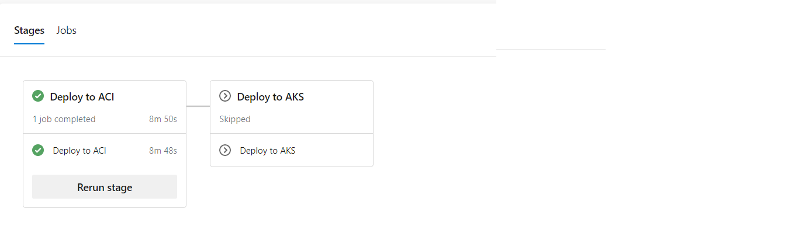

11. Once your pipeline run begins, you can see the model name and version downloaded from the `Model-Train-Register-CI` pipeline.

The pipeline has the following stage:

- Deploy to ACI
    - Deploy the model to the QA environment in Azure Container Instances.
    - Smoke test
        - The test sends a sample query to the scoring web service and verifies that it returns the expected response. Have a look at the smoke [test code](https://github.com/solliancenet/azure-ai-in-a-day-lab-02-starter/blob/master/ml_service/util/smoke_test_scoring_service.py) for an example.