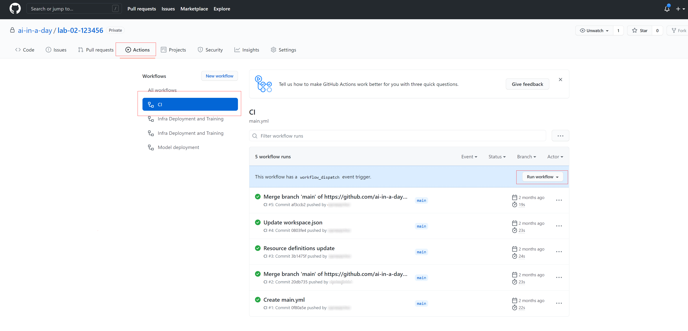
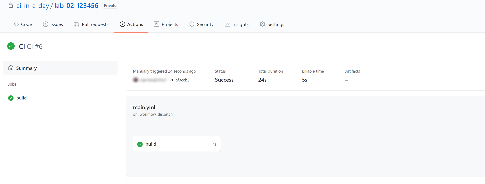

# Lab 2 - Azure Machine Learning Model Operationalization

This lab covers MLOps using Azure DevOps and GitHub, training and deployment of models, real time scoring using a REST API endpoint.

## Task 1 - Explore dashboard of COVID-19 data

Understanding the source datasets is very important in AI and ML. To help you expedite the process, we have created a Power BI dashboard you can use to explore them at the begining of each lab.

To get more details about the source datasets, check out the [Data Overview](../data-overview.md) section.

To explore the dashboard of COVID-19 data, open the `Azure-AI-in-a-Day-Data-Overview.pbix` file located on the desktop of the virtual machine provided with your environment.

## Task 2 - Explore lab scenario

Managing a virtually non-stop flux of incoming research documents should be based on a fully automated and traceable process. Everything from data to code must be tracked and monitored. The complex processes of Machine Learning model training and operationalization require secure, end-to-end approaches that allow teams of developers and analysts to iterate through multiple versions of the solution.

Using GitHub and GitHub Actions, we will build an end-to-end Machine Learning process, where data and code act like inputs and actionable REST API endpoints are the result. Our pipelines will automate building and operationalizing the Machine Learning model that classifies research papers.

The following diagram highlights the portion of the general architecture covered by this lab.

The high-level steps covered in the lab are:

- Explore dashboard of COVID-19 data
- Explore lab scenario
- Overview of CI/CD pipeline
- Perform real time scoring on a REST API endpoint published by the CD component of the pipeline
- Trigger CI/CD pipeline by committing a simple code change
- Monitor execution of CI/CD pipeline all the way to the update on the REST API endpoint
- Perform another real time scoring on the REST API endpoint
- Explore aspects related to traceability and control of the process

## Task 3 - Configure the Azure DevOps project and required Variable group

1. Open the [Azure DevOps portal](https://dev.azure.com/) and select the **Sign in to DevOps** link.
   
    

2. To sign-in, use the Azure credentials provided by the lab environment.
   
3. First time you sign-in to your Azure DevOps account, you are asked to create a new project in the pre-created organization you have available, named 'odluserXXXXXX'. Provide the project name in the following form `odluserXXXXXX-project` and select **+ Create project**
   
   

4. MLOpsPython requires some variables to be set before you can run any pipelines. At this step, you'll create a variable group in Azure DevOps to store values that are reused across multiple pipeline stages. Navigate to **Pipelines**, **Library** and in the **Variable groups** section select **+ Variable group** as indicated bellow.

   

5. To prepare the values you'll need to set all your variables, you need to get the resource group location where all your Azure resources were provisioned. In another browser tab, navigate to the [Azure portal](https://portal.azure.com), sign in with the provided Azure credentials if you are asked to, and navigate to the lab Resource group. On the resourge group overview page, you'll find the location information you need.
   
      

6. Going back to the Azure Devops portal where you created the Variable group for you DevOps project, enter the **Variable group name**: `devopsforai-aml-vg`.
   
7. Add the required list of variables, using the **+ Add** link at the bottom of the **Variables** section as illustrated in the image bellow:

    

    Use values listed in the table:

    | Variable Name            | Suggested Value           | Short description                                                                                                           |
    | ------------------------ | ------------------------- | --------------------------------------------------------------------------------------------------------------------------- |
    | BASE_NAME                | [your project name] e.g. `odluserXXXXXX-project`     | Unique naming prefix for created resources - max 10 chars, letters and numbers only                                         |
    | LOCATION                 | `westus`                 | Resource group location (the value you looked for on the previous step)                             |
    | RESOURCE_GROUP           | `AI-in-a-Day-XXXXXX`                | Azure Resource Group name                                                                                                   |
    | WORKSPACE_NAME           | `ai-in-a-day-XXXXXX`             | Azure ML Workspace name                                                                                                     |
    | AZURE_RM_SVC_CONNECTION  | `azure-resource-connection` | [Azure Resource Manager Service Connection](#create-an-azure-devops-service-connection-for-the-azure-resource-manager) name |
    | WORKSPACE_SVC_CONNECTION | `aml-workspace-connection`  | [Azure ML Workspace Service Connection](#create-an-azure-devops-azure-ml-workspace-service-connection) name                 |
    | ACI_DEPLOYMENT_NAME      | `mlops-aci`                 | [Azure Container Instances](https://azure.microsoft.com/en-us/services/container-instances/) name                           |                 |

8. Make sure you select the **Allow access to all pipelines** checkbox in the variable group configuration.

    

9. Select **Save** from the top menu to create the variable group.

    

## Task 4 - Create an Azure DevOps Service Connection for the Azure ML Workspace

## Task 5 - Review MLOps process

1. Sign-in to [GitHub](https://github.com/ai-in-a-day) with the GitHub user account provided as part of the lab credentials.

2. Browse the code repository containing the MLOps artifacts.

    

3. Select `Actions` from the task bar to review the GitHub Actions available in the repo.

    

4. Select the `CI` action and then select `Run workflow` to trigger the action.

5. Select the action while it's running to check on its status. Wait until the action completes successfully.

    

## Task 4 - Trigger the deployment action

1. From the list of GitHub actions, trigger the `Infra Deployment and Training action`.

2. View the progress of the action. Wait until the action completes successfully.

3. In the [Azure Portal](https://portal.azure.com), sign-in with the user account provided as part of the lab credentials.

4. Open Azure Machine Learning studio, and select `Models` from the left side menu.

5. Observe the newly registered model as part of the deployment action.

## Task 5 - Perform real time scoring using the new model

1. With Azure Machine Learning studio open, select `Notebooks` from the left side menu.

2. Open the `Model Scoring.ipynb` notebook and execute it step by step. Observe the outcomes of the cells.

## Task 6 - Trigger a different training process from Azure DevOps

1. Sign in to [Azure DevOps](https://dev.azure.com/azureaiinaday) with the user account provided as part of the lab credentials.

2. Observe the DevOps project and the pipelines available in the `Pipelines` section.

3. With Azure Machine Learning studio open, select `Notebooks` from the left side menu.

4. Open the `Data Update Trigger.ipynb` notebook and execute it step by step. Observe the outcomes of the cells.

5. Notice how the update performed by the notebook has triggered the MLOps pipeline from Azure DevOps.

6. Return to the `Model Scoring.ipynb` notebook and run it again step by step. Observe the outcomes of the cells and the updated results produced by the model.

