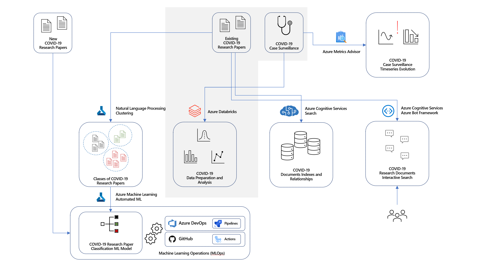

# Lab 3 - Machine Learning in Azure Databricks

The lab covers Data Engineering and Machine Learning using Azure Databricks notebooks.

## Task 1 - Explore dashboard of COVID-19 data

Understanding the source datasets is very important in AI and ML. To help you expedite the process, we have created a Power BI dashboard you can use to explore them at the begining of each lab.

To get more details about the source datasets, check out the [Data Overview](../data-overview.md) section.

To explore the dashboard of COVID-19 data, open the `Azure-AI-in-a-Day-Data-Overview.pbix` file located on the desktop of the virtual machine provided with your environment.

## Task 2 - Explore lab scenario

When data comes in natural language, a data engineering process should transform it into a numerical form useful in Machine Learning. In most cases, some input values will be off (e.g., resulting from human error) or even missing. The same process should be able to identify and handle these cases. Furthermore, analysts need to perform exploratory analysis and various other consistency checks to gain a deep understanding of the data and ensure a level of quality that makes it fit for Machine Learning.

Using Azure Databricks, we will prepare input datasets and analyze their content. We will also attempt to correlate the various datasets and clean their content. We will assess the resulting data quality using both statistical and Machine Learning-based approaches.

The following diagram highlights the portion of the general architecture covered by this lab.

The high-level steps covered in the lab are:

- Explore dashboard of COVID-19 data
- Explore lab scenario
- Explore source data and identify potential issues
- Perform data cleansing on research paper dataset and explore results
- Perform data cleansing on case surveillance data and explore results
- Correlate research paper and case surveillance datasets
- Use SparkML to build risk classifier on case surveillance dataset
- Assess fairness of risk classifier
