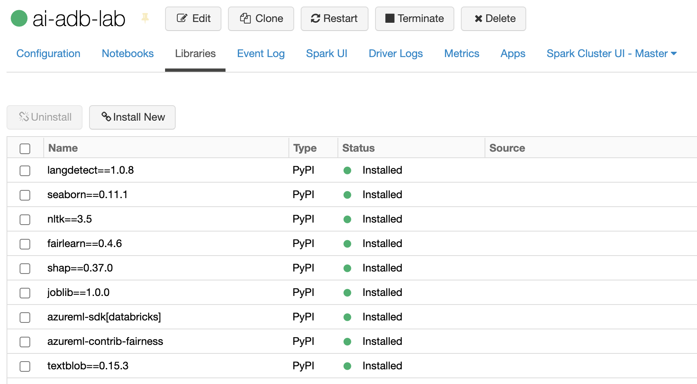

# Setup the Lab 03 AI-in-a-Day workspace

## Task 1 - Create a Machine Learning Workspace

## Task 2 - Create an Azure Databricks Workspace

- **Name**: `ai-adb-ws`
- **Pricing Tier**: `Premium (+ Role-based access controls)`

## Task 3 - Create ADB Cluster

- **Name**: `ai-adb-lab`

- **Databricks Runtime Version**: `7.3 LTS ML (includes Apache Spark 3.0.1, Scala 2.12)`

- **Enable autoscaling**: `Unchecked`

- **Worker Type**: `Standard_DS4_v2`

- **Workers**: `1`

- **Advanced Options/Spark/Environment Variables**
    - PYSPARK_PYTHON=/databricks/python3/bin/python3
    - AML_SUB_ID=xxx-xxx-xxx
    - AML_RG=xxx-xxx-xxx
    - AML_WS=xxx-xxx-xxx

>> Important please provide the `subscription_id`, `resource_group`, and `workspace_name` for the Azure Machine Learning workspace created in Step #1.

## Task 4 - Install Libraries on the ADB cluster

**Install Library/PyPI**
- langdetect==1.0.8
- seaborn==0.11.1
- nltk==3.5
- fairlearn==0.4.6
- shap==0.37.0
- joblib==1.0.0
- azureml-sdk[databricks]
- azureml-contrib-fairness
- textblob==0.15.3

