# Lab 4 - Conversational AI with Azure Bot Service and Cognitive Services

This lab covers Azure Bot Service, Bot Framework Composer, and Azure Cognitive Services.

## Task 1 - Explore dashboard of COVID-19 data

Understanding the source datasets is very important in AI and ML. To help you expedite the process, we have created a Power BI dashboard you can use to explore them at the beginning of each lab.


To get more details about the source datasets, check out the [Data Overview](../data-overview.md) section.

To explore the dashboard of COVID-19 data, open the `Azure-AI-in-a-Day-Data-Overview.pbix` file located on the desktop of the virtual machine provided with your environment.

## Task 2 - Explore lab scenario

The power of Machine Learning also comes into play when dealing with human-to-machine interfaces. While classical interfaces like native or web applications are ubiquitous, the new approaches based on conversational AI are becoming increasingly popular. Having the capability to interact with intelligent services using natural language is quickly becoming the norm rather than the exception. Using Conversational AI, analysts can find the research of interest by using simple natural language phrases.

Using Azure Bot Service and Cognitive Services, we provide a conversational bot that helps analysts navigate the corpus of research documents and identify the most relevant ones.

The following diagram highlights the portion of the general architecture covered by this lab.

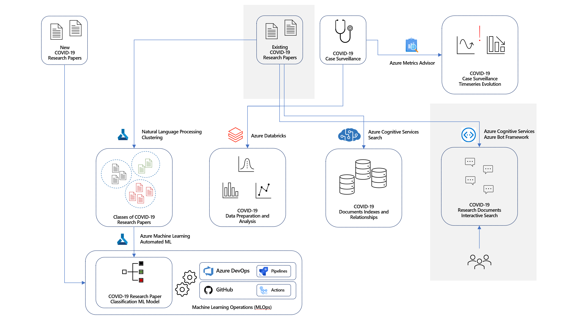

The high-level steps covered in the lab are:

- Explore dashboard of COVID-19 data
- Explore lab scenario
- Interact with the AI-in-a-Day conversational bot
- Extend the behavior of the conversational bot using the Bot Framework Composer (and LUIS)
- Deploy the updated version of the conversational bot
- Interact with an improved version of the AI-in-a-Day conversational bot

With Machine Learning (ML) and Natural Language Processing (NLP), Human Machine Interface (HMI) technologies are enjoying an increased adoption year over year. By 2021, [the growth of chatbots in this space is expected to be 25.07%](https://www.technavio.com/report/chatbot-market-industry-analysis). This lab will focus on conversational AI and NLP to help analysts dig into vast amounts of research documents.


First, we will start with a prepopulate Azure Cognitive Search knowledge base enhanced with Azure Cognitive Skills to test our foundational Bot based on old-fashion keyword lookup, regular expressions. Next, we will extend our conversational Bot's behavior using the Bot Framework Composer and Azure Language Understanding (LUIS). Finally, we will deploy our Bot to Azure Bot Service and enable voice access to our Bot using Cognitive Speech Services and Direct Line Speech channel.

## Task 3 - Setting Azure Cognitive Search for a Chatbot

1. Launch the **Bot Framework Composer (1)** from its shortcut on Desktop. Select **Open (2)** to load our starter project.

   

   > **WARNING**: If you are asked for an application update such as below, please select X or Cancel and disregard the update.
   >
   > 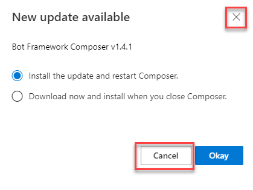

2. Navigate to your **Desktop** folder **(1)**. Select the **AI-in-a-Day-Bot** by double-clicking **(2)** on it.

   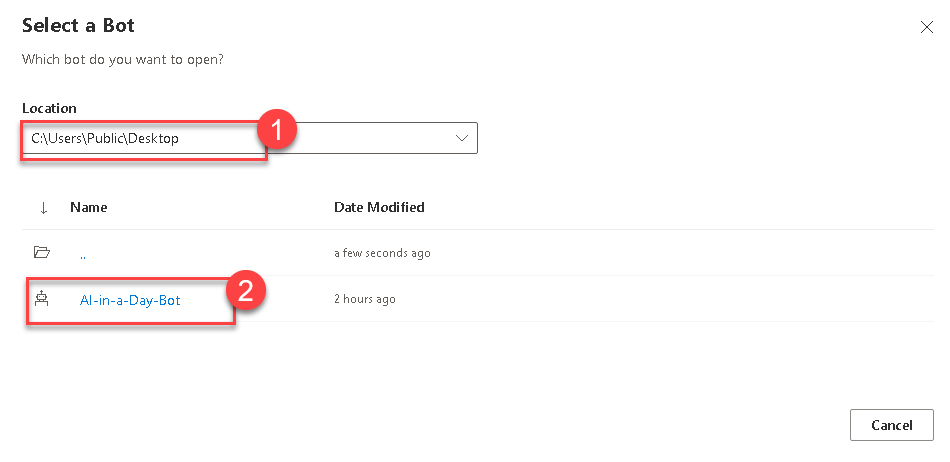

3. In a Microsoft Edge web browser *(Do not close the Bot Framework Composer)*, navigate to the Azure portal (<https://portal.azure.com>) and log in with your credentials. Then select **Resource groups**.

   

4. Select the **AI-in-a-Day** resource group.

5. Select the Azure Cognitive Search service.

   

6. Select **Indexes (1)** and observe the number of documents indexed in the **cognitive-index (2)**.

   

7. Select **Search Explorer** to navigate to a web-based search experience where you can discover the data in the index.

   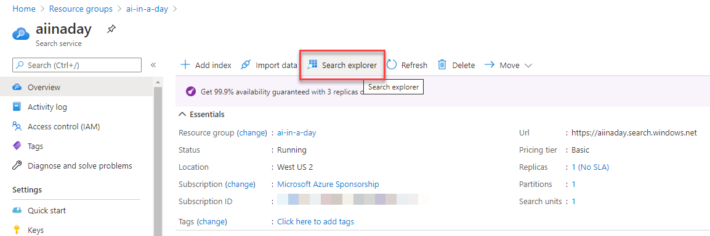

8. Select **Search (1)** to access a sample set of documents from the index. Scroll down and observe the data stored in the index. The values for the fields `people`, `organizations`, `locations`, and `keyphrases`, are created through the use of Azure Cognitive Services as part of the data enrichment process during data indexing.

   

9. Close the **Search Explorer**. Navigate to the **Keys (1)** panel. Copy the primary admin key by selecting the copy command **(2)**. Take note of the service name for your Azure Cognitive Search **(3)** for use in the next step.

   

10. Now it's time to change the access keys used in our starter Bot to use our Azure Cognitive Search service. Go back to the Bot Framework Composer. Select **Greeting** trigger **(1)**. From the design surface, select the first **Set a property** activity **(2)**. You will see a **Value** field **(3)** on the right panel. We have to change the value with the primary admin key we have copied from the Azure Portal.

    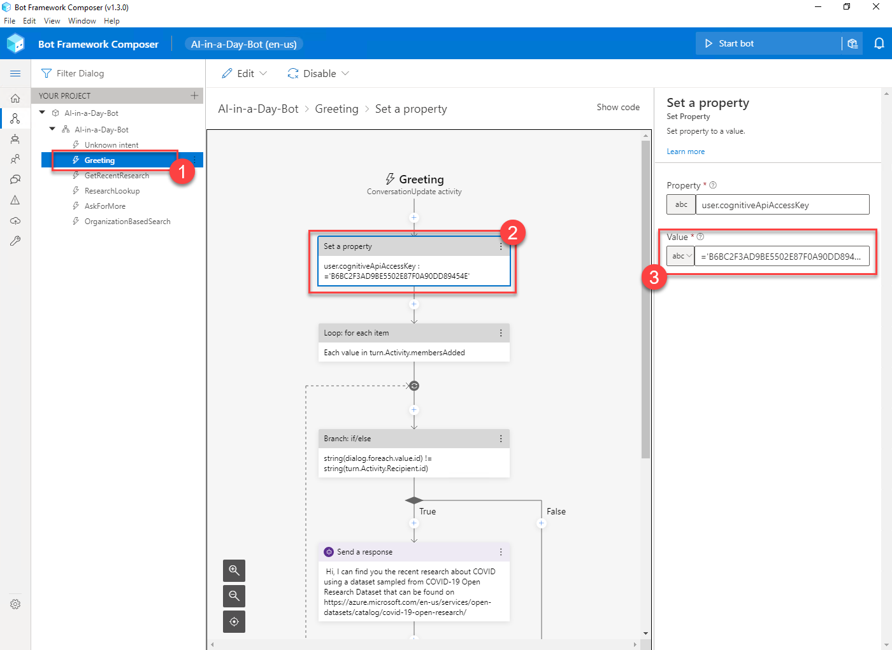

11. Our next step is to replace the Azure Cognitive Search endpoints used in the application with the one that you just noted in Step 9. Select **GetRecentResearch** trigger **(1)**. From the design surface, select the first **Send an HTTP request** activity **(2)**. You will see a **Url** field **(3)** on the right panel. We have to change the value `aiinaday` with the Azure Cognitive Search endpoint you coped previously. Repeat the same for `ResearchLookup`, `AskForMore`, and `OrganizationBasedSearch` triggers as well.

    

## Task 4 - Running AI-in-a-Day Conversational Bot for the First Time

1. It is time to start our bot. Select **Start bot** from the top of the window in the Bot Framework Composer.

   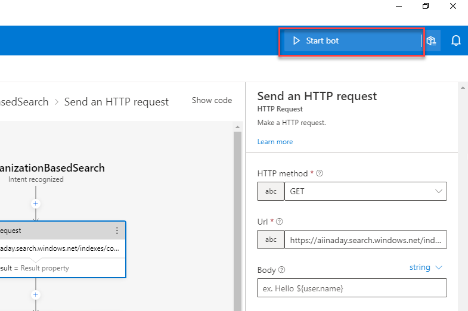

2. Once the local bot runtime is ready, a pop-up will appear. Hover **Test in Emulator (2)** and copy the local bot API endpoint **(3)**.

   

3. Launch the **Bot Framework Emulator (1)** from its shortcut on Desktop. Select **Open Bot (2)** and paste the API endpoint **(3)** you copied in the previous step. Select **Connect (4)** to continue.

   > **WARNING**: If you are asked for an application update such as below, please select X or Cancel and disregard the update.
   >
   > 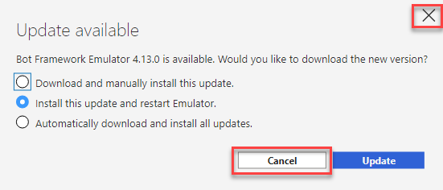

   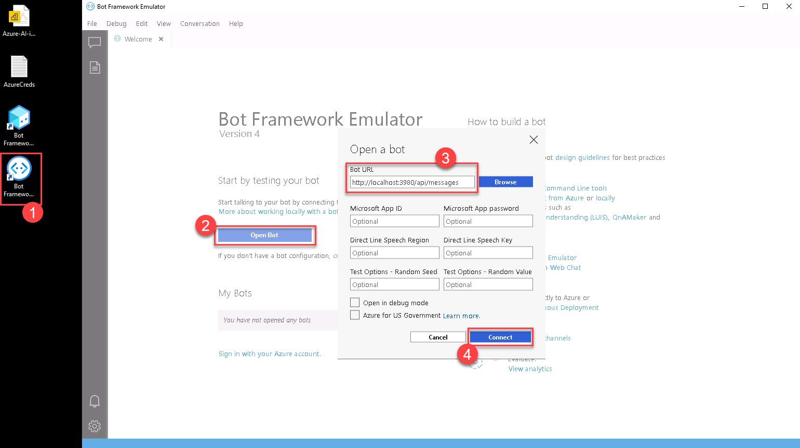

4. Write `What is the latest research?` and observe **(1)** how the bot will respond. You can see the API communication between the emulator and the bot in the list of logs **(2)**.

   

5. Write `Find me publications about SARS` and observe how the bot will respond.

   

6. Write `More` and observe how the bot will respond.

   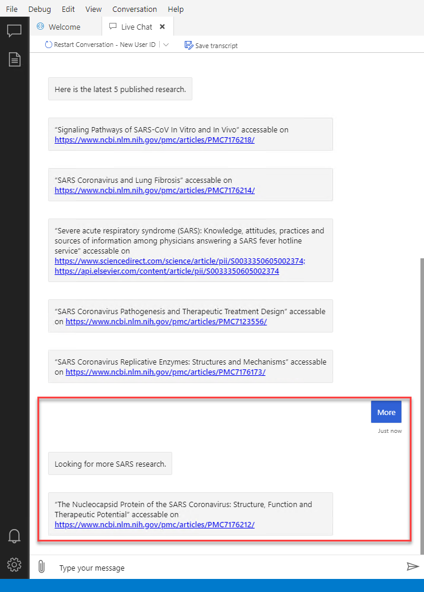

7. Write `Find me publications from WHO` and observe how the bot will respond.

   

8. Now, let's go back to the **Bot Framework Composer** and see how the bot understands our commands. Select **GetRecentResearch** trigger **(1)** and look at the trigger phrase **(2)**. Our current trigger phrase is set to exactly match what we previously wrote in chat in the Bot Framework Emulator.

   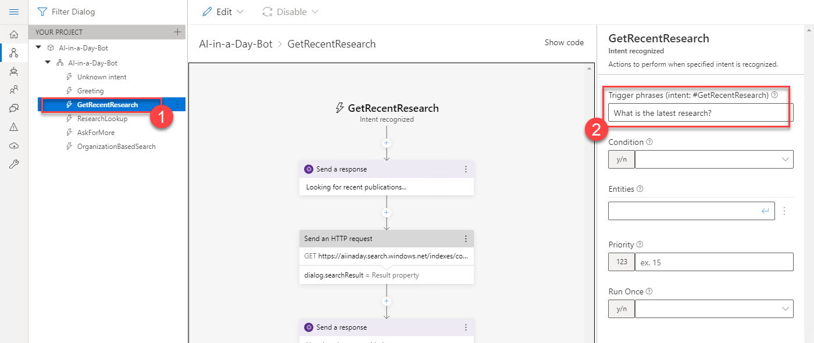

9. Switch back to the emulator and write, `What is the latest resarch?`. You will see that our bot can't understand the message anymore. So far, our bot has used **Regular Expression Recognizer** as its Language Understanding engine. The current setup for the **GetRecentResearch** trigger matches only an exact text to detect user intent. A simple typographical error results in a failure.

   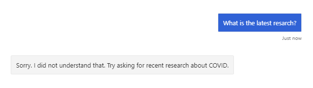

10. Switch back to the **Bot Framework Composer** and select **ResearchLookup (1)**. Remember, previously, we asked the bot `Find me publications about SARS` to get the latest COVID research related to SARS. You can find the regular expression used to detect the user's intent in the **Trigger Phrases (2)** section. If the user writes anything else, maybe a typographical error, the bot will fail to understand its user's intent.

    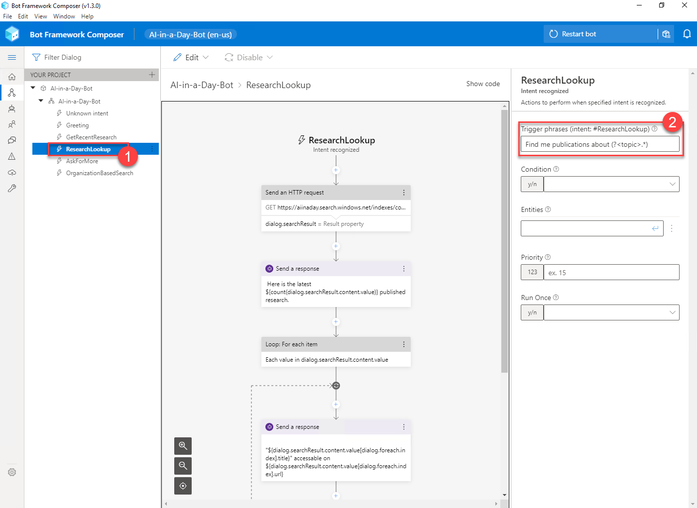

11. Feel free to look into the other triggers in the starter project and ask different questions to our bot to test how the different regular expressions set for the current triggers work.

## Task 5 - Extending Our Conversational Bot Using LUIS

Our Bot is now using a **Regular expression recognizer** as its Language Understanding engine. We will extend our Bot with [Azure Language Understanding (LUIS)](https://www.luis.ai/) service. LUIS is a machine learning-based service to build natural language into apps, bots, and IoT devices. LUIS will not only help us build a model but continuously improve as well.

1. Select **AI-in-a-Day-Bot (1)** under the **Your Project** tree view in the Bot Framework Composer. On the right panel, select **Default Recognizer (2)** instead of **Regular Expression Recognizer** as the Language Understanding engine type. Once set, you will receive an error referring to the missing LUIS keys **(3)**. Select **Fix in bot settings (3)** to navigate to **Project Settings** page.

   

2. In a Microsoft Edge web browser *(Do not close the Bot Framework Composer)*, navigate to the LUIS portal (<https://www.luis.ai/>) and log in with your credentials. Then select your subscription **(1)** and the authoring resource **(2)**. The LUIS authoring resource allows you to create, manage, train, test, and publish your applications. Select **Done (3)** to proceed.

   

3. Select the **Settings** button from the top blue bar.

   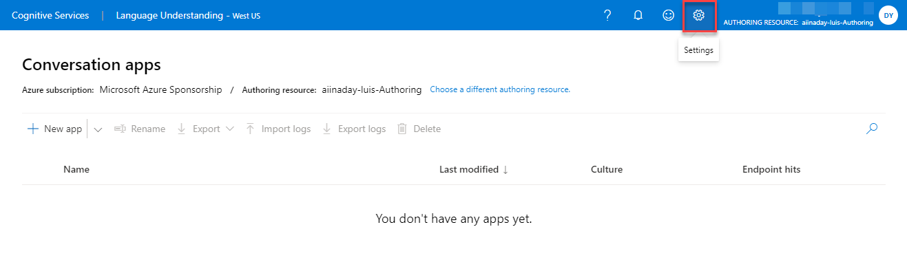

4. Select your subscription **(1)** and the authoring resource **(2)**. Drill down through the arrow button **(3)** to access Authoring resource information. Take note of the **Location (4)** and **Primary Key (5)**.

   

5. Switch back to the Bot Framework Composer. Type in the **primary key** you noted from the previous step into the **LUIS Authoring key** field (1). Select the **location** you noted from the earlier step of the **LUIS region** selection list (2).

   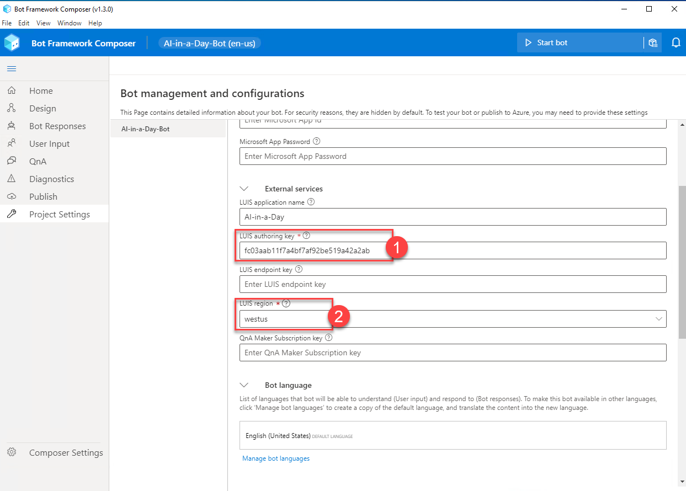

6. Switch to the **Design (1)** view. Select **ResearchLookup (2)** trigger.

   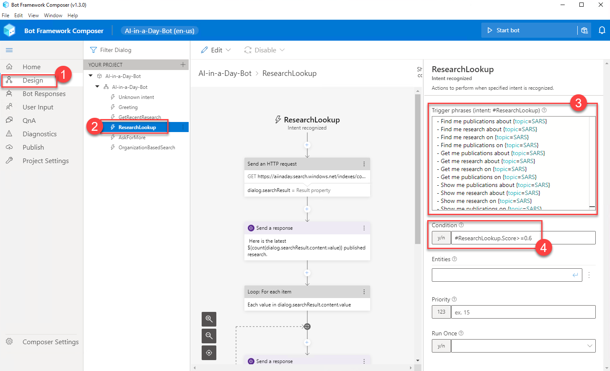

7. Copy and paste the below language understanding code with a list of utterances with a single machine-learning entity type definition called `topic` into the **Trigger phrases** box **(3)**. All topic entities below are labeled with values that LUIS will use as part of the machine learning data set. This is a small set of data. We will have the chance to add more later in the lab, on the LUIS portal.

   ```plaintext
   - Find me publications about {topic=SARS}
   - Find me research about {topic=SARS}
   - Find me research on {topic=SARS}
   - Find me publications on {topic=SARS}
   - Get me publications about {topic=SARS}
   - Get me research about {topic=SARS}
   - Get me research on {topic=SARS}
   - Get me publications on {topic=SARS}
   - Show me publications about {topic=SARS}
   - Show me research about {topic=SARS}
   - Show me research on {topic=SARS}
   - Show me publications on {topic=SARS}
   - Find me publications about {topic=ICU}
   - Find me research about {topic=ICU}
   - Find me research on {topic=ICU}
   - Find me publications on {topic=ICU}
   - Get me publications about {topic=ICU}
   - Get me research about {topic=ICU}
   - Get me research on {topic=ICU}
   - Get me publications on {topic=ICU}
   - Show me publications about {topic=ICU}
   - Show me research about {topic=ICU}
   - Show me research on {topic=ICU}
   - Show me publications on {topic=ICU}
   - Find me publications about {topic=Pathogenesis}
   - Find me research about {topic=Pathogenesis}
   - Find me research on {topic=Pathogenesis}
   - Find me publications on {topic=Pathogenesis}
   - Get me publications about {topic=Pathogenesis}
   - Get me research about {topic=Pathogenesis}
   - Get me research on {topic=Pathogenesis}
   - Get me publications on {topic=Pathogenesis}
   - Show me publications about {topic=Pathogenesis}
   - Show me research about {topic=Pathogenesis}
   - Show me research on {topic=Pathogenesis}
   - Show me publications on {topic=Pathogenesis}
   ```

8. Type in `#ResearchLookup.Score>=0.6` into the **Condition (4)** box. This will be our prediction scoring setting for the **ResearchLookup** intent.

   

9. Select **OrganizationBasedSearch (1)** trigger. Copy and paste the below language understanding code into the **Trigger phrases** box **(2)**. Type in `#OrganizationBasedSearch.Score>=0.6` into the **Condition (3)** box.

   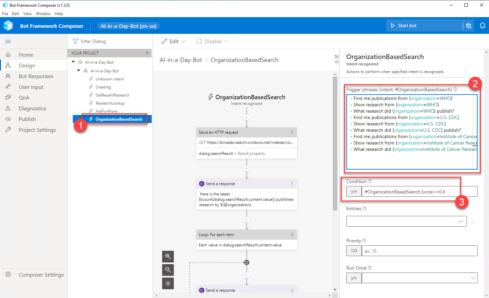

   ```plaintext
   - Find me publications from {organization=WHO} 
   - Show research from {organization=WHO} 
   - What research did {organization=WHO} publish?
   - Find me publications from {organization=U.S. CDC}  
   - Show research from {organization=U.S. CDC} 
   - What research did {organization=U.S. CDC} publish?
   - Find me publications from {organization=Institute of Cancer Research} 
   - Show research from {organization=Institute of Cancer Research} 
   - What research did {organization=Institute of Cancer Research} publish?
   ```

10. Select **AskForMore (1)** trigger. Type in `-More` into the **Trigger phrases** box **(2)**. Feel free to improve the utterances for this Intent by adding more examples.  

    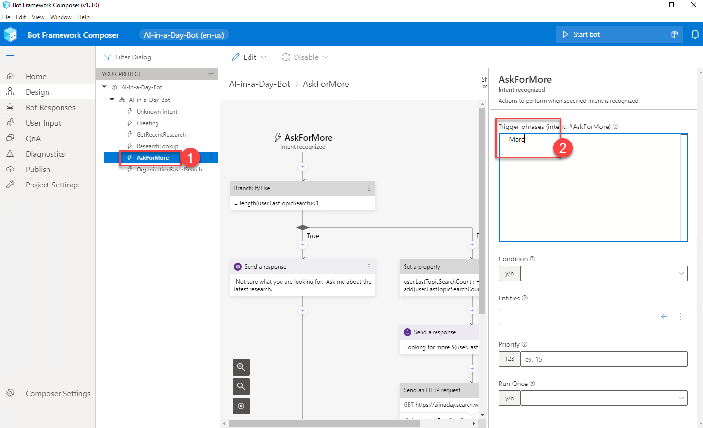  

11. Now that we have set with all our LUIS intents, entities and labels, we can start our bot to test locally in the Bot Framework Emulator.

    

12. What about testing the typographical error that failed with our bot's previous version that did not have LUIS's help? Keep in mind that, for the **GetRecentResearch** intent, we still have a single utterance, as shown below.

    

    Here we go, type `What is the latest resarch?` and see what happens.

    

    It looks like LUIS was able to understand what we meant without being too picky with typographical errors.

13. Before we go too far with testing, let's take a look at the LUIS portal to see what happened there. Navigate to [https://www.luis.ai/applications](https://www.luis.ai/applications) in your browser to see a refreshed list of applications.

    

     When we started our local bot through Bot Framework Composer, the composer connected to LUIS Authoring service in Azure to set things up for our bot. Our bot is running locally but connecting to the cloud to talk to the LUIS service.

14. Select the application to see more details.

15. Once you are on the application page, you can see a list of **intents** **(2)**. These are the **triggers** we configured in our bot. The number of **examples** **(3)** listed is the number of utterances we provided as **trigger phrases** in the Bot Framework Composer.

     

16. Select the **Entities page (1)** in the portal. Observe the list of entities **(2)** and their type listed as machine learned **(3)**.

     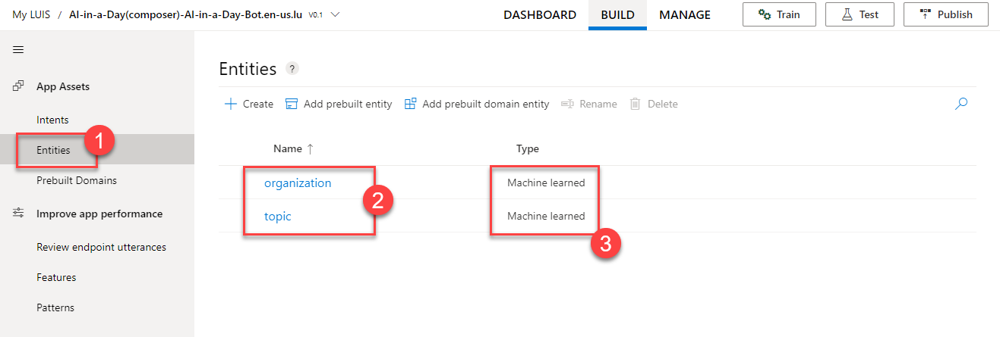

17. Select the **Review endpoint utterances (1)** page in the portal. This is where we can see a list of utterances users wrote and LUIS predicted, but they are outside the original utterance list we provided. In this case, LUIS did a great job predicting that the `What is the latest resarch?` message was targeting the **GetRecentResearch** intent. If needed, we can change the predicted intent and select the **Save** button **(4)** to add the new utterance for future training. This will help LUIS learn and improve its predictions.

     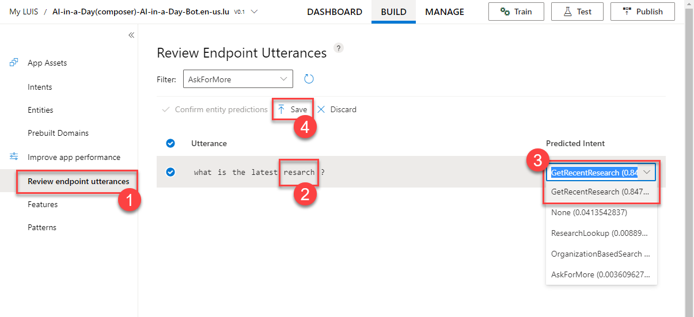

18. Now, back to our Bot Emulator for more testing. We will test the **OrganizationBasedSearch** Trigger. As a reminder, here is the list of utterances we provided to LUIS.

     ```plaintext
     - Find me publications from {organization=WHO} 
     - Show research from {organization=WHO} 
     - What research did {organization=WHO} publish?
     - Find me publications from {organization=U.S. CDC}  
     - Show research from {organization=U.S. CDC} 
     - What research did {organization=U.S. CDC} publish?
     - Find me publications from {organization=Institute of Cancer Research} 
     - Show research from {organization=Institute of Cancer Research} 
     - What research did {organization=Institute of Cancer Research} publish?
     ```

     Let's write `any research from Soochow University?` to mix things up. None of the utterances above is a perfect match to what we are going to try.

     

     Everything worked fine. It looks like our Bot is in much better shape with the help of LUIS's natural language processing skills. Feel free to test the other intents with phrases like `Show me what's published on SARS` and keep training your model to improve it.

## Task 6 - Deploying Our Bot to Azure Bot Service

It's time to publish our bot to an Azure Bot Service. An Azure Bot Service is not just a location to host a bot. It helps a bot connect to multiple communication channels such as Microsoft Teams, Skype, Slack, Cortana, and Facebook Messenger. In combination with out-of-box Cognitive Service integrations, Azure Bot Service can accelerator growing your bot with new skills. Let's start with baby steps.

1. Go back to the **Bot Framework Composer** and switch to **Project Settings (1)**. Select **Add new publish profile (2)**.

   

2. Name your profile `ai-in-a-day` **(1)** and select **Publish bot to Azure Web App (2)** option as the publish target. Select **Next: Configure resources (3)** to move to the next step.

   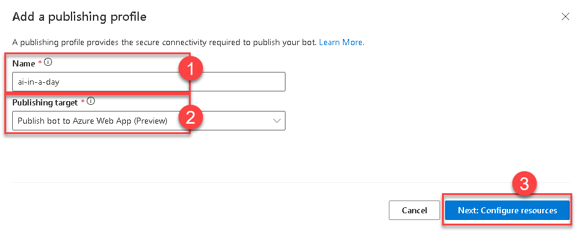

3. We have to go back to the Azure Portal for a moment to grab some key information we will need during the next step. We need the **Resource Group Name** where our Cognitive Services live, and we need the location of the Cognitive Services. Take note of both values to be used in the next step.

   

4. Select your subscription and type in your **Azure Resource Group** name into the **Resource group name (2)** box. Type in the same name into the **Resource Name (3)** box as well. This is going to be the name of the web application that will host our Bot App in Azure. Next, please select the location of your Cognitive Services to make sure our bot is deployed to the same location **(4)**. Select **Next:Review (5)** to continue.

   

5. Make sure you deselect **(1)** all optional resources. We have some of these resources already in place. We will connect those to our deployment profile in the next steps. Select **Next (2)** to proceed.

   

6. On the next screen, select **Done** to start deployment.

7. The Bot Framework Composer registered our bot and provisioned the resources **(1)** needed to host our bot in Azure. Now, we have to connect our deployment to our current LUIS Cognitive service. Select **Edit (2)**.

   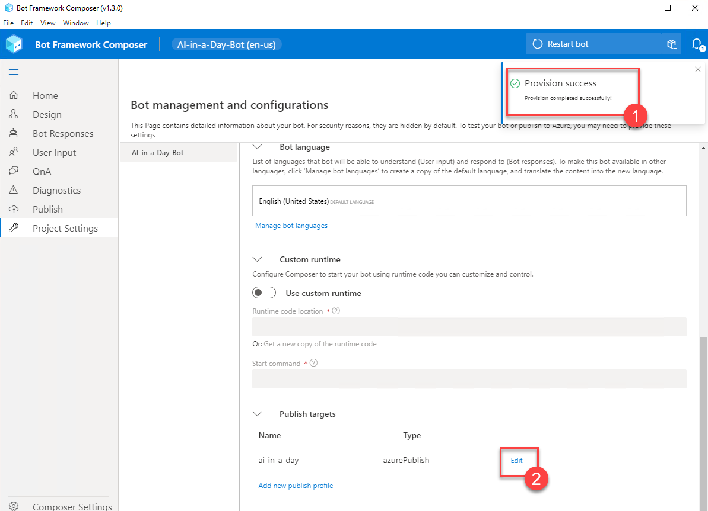

8. Look at the **Config Resources** section **(1)**. We have to type in a couple of keys and endpoints to make sure our bot can talk to our LUIS Cognitive service that is already in our Azure subscription.

   

   Below is a snippet of the **Publish Configuration** where we have to configure all the fields listed.

   ```json
       "luis": {
         "authoringKey": "<authoring key>",
         "authoringEndpoint": "",
         "endpointKey": "<endpoint key>",
         "endpoint": "",
         "region": "eastus"
       }
   ```

9. Let's start with the **authoringKey** and **authoringEndpoint**. Go to the Azure Portal and select the cognitive service that has `auth` in its name. This is the LUIS Cognitive service that is used for authoring language content.

   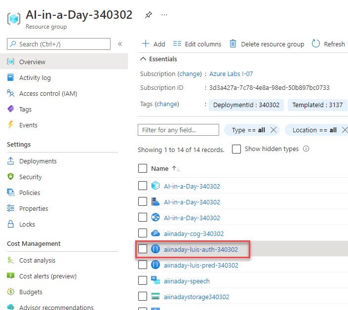

10. Select **Keys and Endpoint (1)** section. Copy **Key 1** to the **authoringKey** field replacing `<authoring key>`. Copy **Endpoint** to the **authoringEndpoint** field. Finally, copy **Location** to the **region** field.

    

11. The next step is to get the Key and Endpoint for the Prediction Cognitive Service. Go back to the list of resources in the Azure Portal. This time, select the cognitive service called `aiinaday-luis-pred`.

    

12. Select **Keys and Endpoint (1)** section. Copy **Key 1** to the **endpointKey** field replacing `<endpoint key>`. Copy **Endpoint** to the **endpoint** field.

    

    Below is an example of how the luis section of your **Publish Configuration** will look like. In your case, all values will be the values you copied from your Azure subscription.

    ```json
        "luis": {
          "authoringKey": "53070e6f36eb4c7c965c06ebfaf1f6ac",
          "authoringEndpoint": "https://aiinaday-luis-authoring.cognitiveservices.azure.com/",
          "endpointKey": "5c5169e226f94d409eea6db6edad2c10",
          "endpoint": "https://aiinaday-luis.cognitiveservices.azure.com/",
          "region": "westus"
        }
    ```

13. One final value that has to be added in the **Publish Configuration** is the Luis resource name **(1)**. This is the name of the prediction Luis Cognitive Service that we selected in the previous step.

    ```json
       "luisResource":"aiinaday-luis-pred",
    ```

    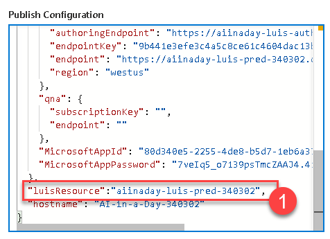

    Once that is done. Select **Save** **(2)**.

14. Switch to the **Publish (1)** section in the Bot Framework Composer. Select our bot **(2)** and select **Publish selected bots (3)** to start the publish process.

    

15. Select **"Okay"** to approve the publishing.

    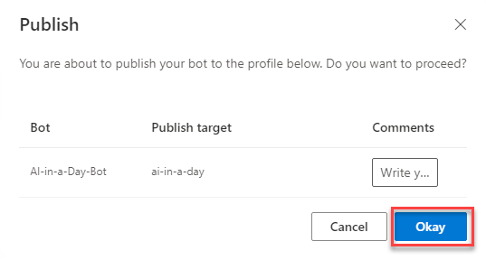

16. Once publishing is complete, go to the Azure Portal and select the **Bot Channels Registration** service.

    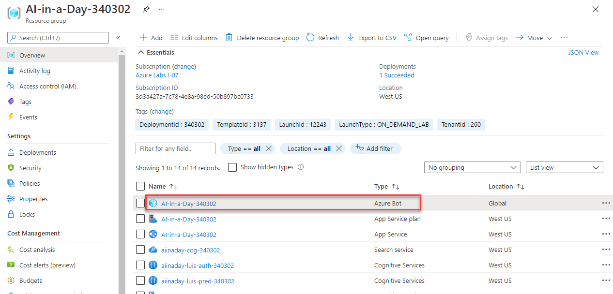

17. Switch to the **Test in Web Chat (1)** tab. This is where you can test our bot live in Azure. Feel free to ask questions and observe the results **(2)** we previously tested locally.

    

## Task 7 - Enabling Voice Access for Our Bot

> **WARNING**: This task requires access to Microphone hardware in your environment. If you are running your lab through a remote desktop connection, additional setup might be required. As an alternative, you can run the VoiceAssistantClient that is used in the lab in your local machine instead of a remote Virtual machine. If both options are not working, you might not be able to demo the functionality after step 5. In this case, you can download a video version of the end-user experience [here](media/DLS-chatbot-demo.mp4).

In this task, we will enable voice access to our Bot through the use of AI. We will use **Azure Cognitive Speech Services** to enable real-time speech to text and text to speech conversion. Thanks to **Bot Channels Registrations** in **Azure Bot Service**, we can use the Direct Line Speech channel to have our Bot drive audio-only conversations with client applications.

1. Switch to the **Channels (1)** tab in the **Bot Channels Registration** service. Select **Direct Line Speech (2)**.

   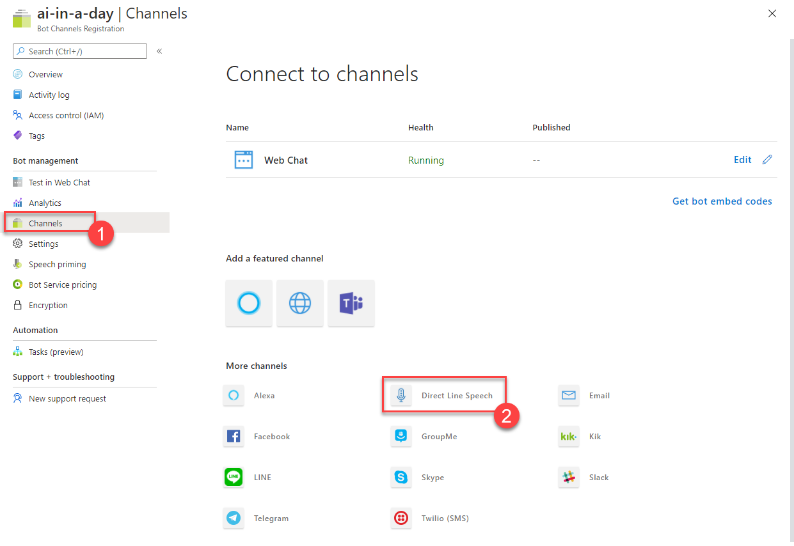

2. Select the Cognitive Speech Service named `aiinaday-speech` **(1)** for your **Cognitive service account** and hit **Save (2)**.

   

   You will now see two channels for your bot.

   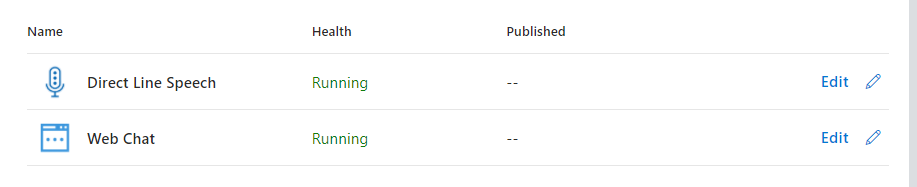

3. Go back to your Resource Group and select the `ai-in-a-day` app service.

   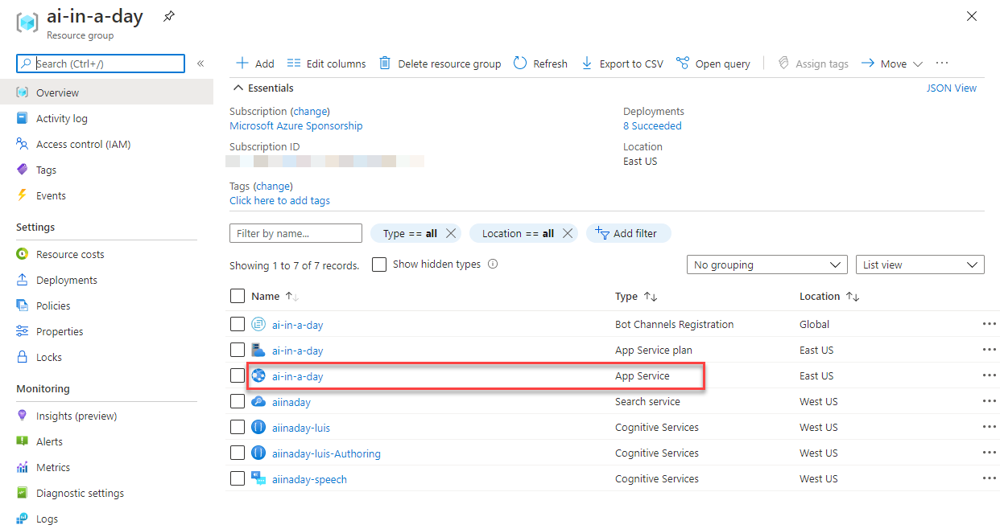

4. Switch to the **Configuration (1)** tab. Select **General settings (2)**. Check **On (3)** for Web sockets and select **Save (4)**.

   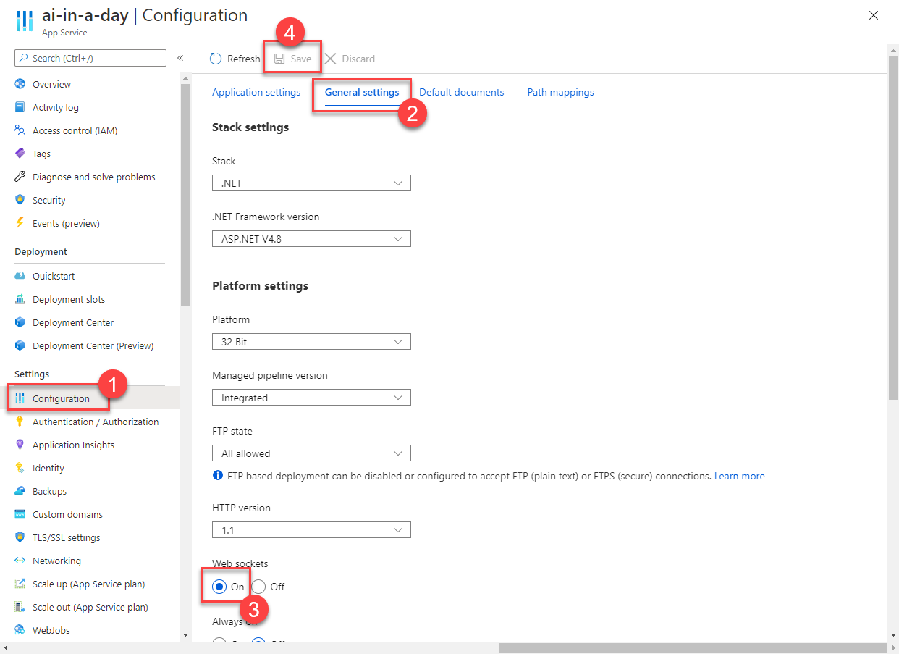

5. In a Microsoft Edge web browser, navigate to the Github Releases page of the Cognitive-Services-Voice-Assistant project here [https://github.com/Azure-Samples/Cognitive-Services-Voice-Assistant/releases](https://github.com/Azure-Samples/Cognitive-Services-Voice-Assistant/releases) and download the released ZIP file **(1)**. Select **Open (2)** when the download is completed.

   > **Note:** If you are not able to download and install applications to your computer, you can watch a demo of the final result in a [video here](media/DLS-chatbot-demo.mp4).

   

6. Navigate into the folder in the ZIP file and find the **VoiceAssistantClient (1)** application file. Double click to start the program. When prompted, select **Extract all (2)** to temporarily extract the ZIP file's contents.

   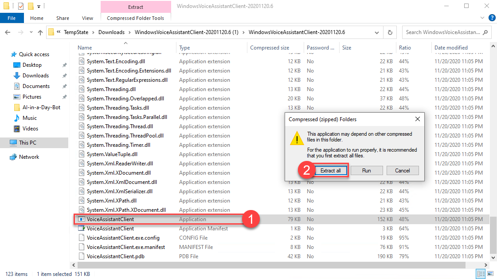

7. Select **Extract**. Once extraction is complete, a folder window will pop up.

   

8. Navigate into the `WindowsVoiceAssistantClient-<date>` folder and find the **VoiceAssistantClient** program. Double click the program to start it.

   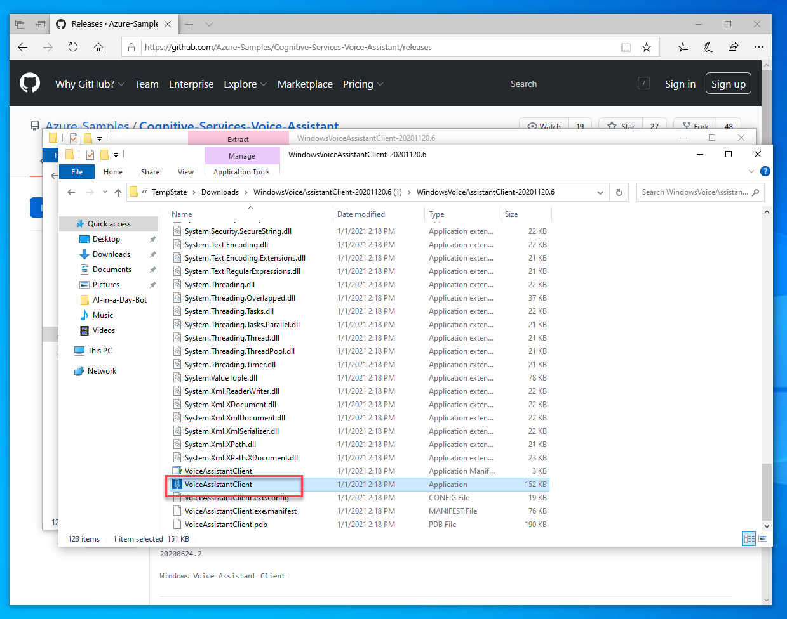

9. Once the program opens, it will show you its **Settings** window. If the **Settings** window does not show up, select **Settings gear button (A)** to open the window. We need two values for the settings page: **Subscriptions key** and **Subscription key region (1)**. These are the Azure Cognitive Speech Service's key and region values in our Azure subscription.

    

10. Back in the Azure Portal, select the `aiinaday-speech` service.

    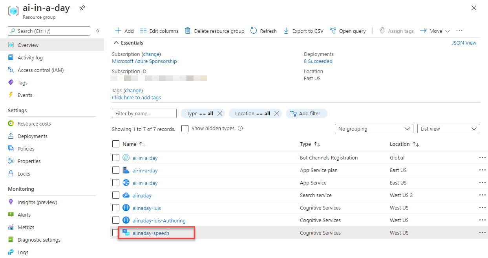

11. Switch to the **Keys and Endpoint (1)** tab. Copy **Key 1 (2)** into the **Subscription Key** textbox in the Settings window of the Windows Voice Assistant Client. Copy **Location (3)** into the **Subscription Key Region** textbox in the Settings window of the Windows Voice Assistant Client. Type in a **Connection profile** name **(3)** and select **Save and Apply Profile (4)**.

    

12. Select **Reconnect (1)** to connect to the bot. You will hear the greeting message first. At any point, feel free to select the **Microphone button (2)** and talk to your bot.

   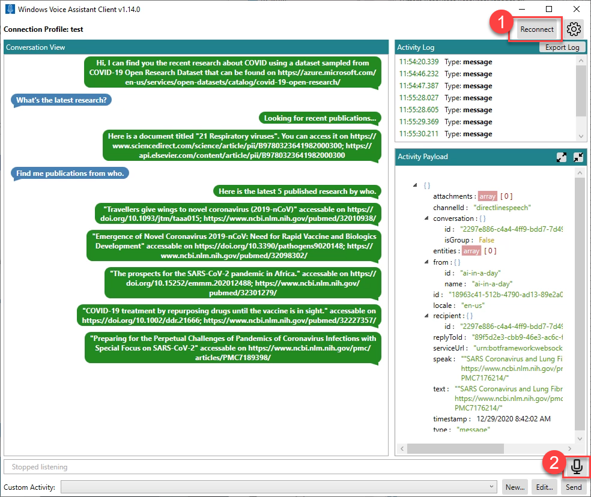
