# Lab 4 - Knowledge Mining with Azure Cognitive Search and Text Analytics

TODO:  Intro

## Lab Requirements

In order to work through this lab, you will need the following tools installed:

* Python 3.  Python version 2 is not supported for this lab.
* PowerShell 5 or later.  To determine your version, open up a PowerShell prompt and enter `Get-Host`.  If the `Version` does not start with a 5 (or higher number), the PowerShell commands in this lab may not work.
* [Azure Storage Explorer](https://azure.microsoft.com/en-us/features/storage-explorer/).

The virtual machine which accompanies this lab will have all of these tools installed.

## Task 1 - Creating Azure Search Indexes

1. Navigate to [the Azure portal](https://portal.azure.com) and log in with your credentials.  Then, select **Resource groups**.

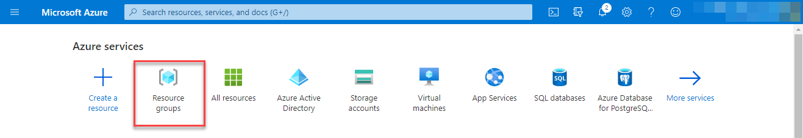

2. Select the **AI-in-a-Day** resource group.

3. Select the Storage account.


4. Navigate to the **Access keys** setting.  Then, select **Show keys** and copy the connection string for `key1`.  Paste this into a text file.


5. Return to the **AI-in-a-Day** resource group.  Then, select the Search service.


6. Copy the search service URL and paste this into a text file.  Also make note of the service account name, which comes before `.search.windows.net`.

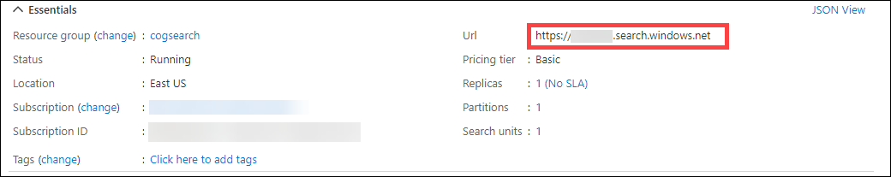

7. Navigate to the Keys setting and copy the Primary admin key.  Paste this into a text file.

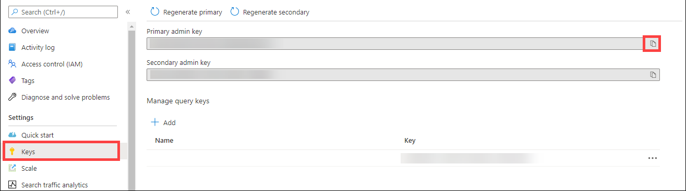

8. Download the files in the `schemas\` folder.  There are six files, three prefixed with `abstracts` and three with `covid19temp`.  Save these to a directory such as `C:\Temp\AzureSearch\`.

9. Open the `abstracts_datasource.schema` file with a text editor and replace the segment starting `<< TODO:` with your Storage account connection string.  Do the same for `covid19temp_datasource.schema`.


10. Open a new PowerShell prompt.  Enter the following code, which will create an Azure Search data source, index, and indexer.

```powershell
function Create-AzureSearchIndex {
    param
    (
        [string]$DataSourceFilePath,
        [string]$IndexFilePath,
        [string]$IndexerFilePath,
        [string]$AccountName,
        [string]$ApiKey
    )
    
    $Header = @{
        "api-key" = $ApiKey
    }
    $BaseUri = "https://" + $AccountName + ".search.windows.net"
    
    # Create Data Source
    $Uri = $BaseUri + "/datasources?api-version=2020-06-30"
    Invoke-RestMethod -Method Post -Uri $Uri -Header $header -ContentType "application/json" -InFile $DataSourceFilePath
    
    # Create Index
    $Uri = $BaseUri + "/indexes?api-version=2020-06-30"
    Invoke-RestMethod -Method Post -Uri $Uri -Header $header -ContentType "application/json" -InFile $IndexFilePath
    
    # Create Indexer
    $Uri = $BaseUri + "/indexers?api-version=2020-06-30"
    Invoke-RestMethod -Method Post -Uri $Uri -Header $header -ContentType "application/json" -InFile $IndexerFilePath
}
```


11. In the same PowerShell prompt, call this function for the `abstracts` index and for the `covid19temp` index.  If you did not use `C:\Temp\AzureSearch\` to save your schema files, change the function call to point to the correct file location.  Then, fill in your Azure Search account name and Azure Search API key.

```powershell
Create-AzureSearchIndex "C:/Temp/AzureSearch/abstracts_datasource.schema" "C:/Temp/AzureSearch/abstracts.schema" "C:/Temp/AzureSearch/abstracts_indexer.schema" "<<ACCOUNT NAME>>" "<<API KEY>>"

Create-AzureSearchIndex "C:/Temp/AzureSearch/covid19temp_datasource.schema" "C:/Temp/AzureSearch/covid19temp.schema" "C:/Temp/AzureSearch/covid19temp_indexer.schema" "<<ACCOUNT NAME>>" "<<API KEY>>"
```


## Task 2 - Querying Azure Search Indexes

1. Navigate to [the Azure portal](https://portal.azure.com) and log in with your credentials.  Then, select **Resource groups**.


2. Select the **AI-in-a-Day** resource group.

3. Select the Search service.


4. Select the **Indexes** tab and ensure that you have two indexes created.  If the Document Count is 0 for either, wait a couple of minutes and select **Refresh** until the document count appears.


5. Once documents are available, select **Search Explorer** to open up the Search Explorer.


6. Choose the **covid19temp** index and enter `RNA interference` into the Query string input box, and then select **Search**.  This will return the documents which include the phrase "RNA interference."


7. We can also see how many articles match a certain search string.  In the Query string input box, enter the phrase `Brazil&$count=true` and then select **Search**.  This will return 53 documents.

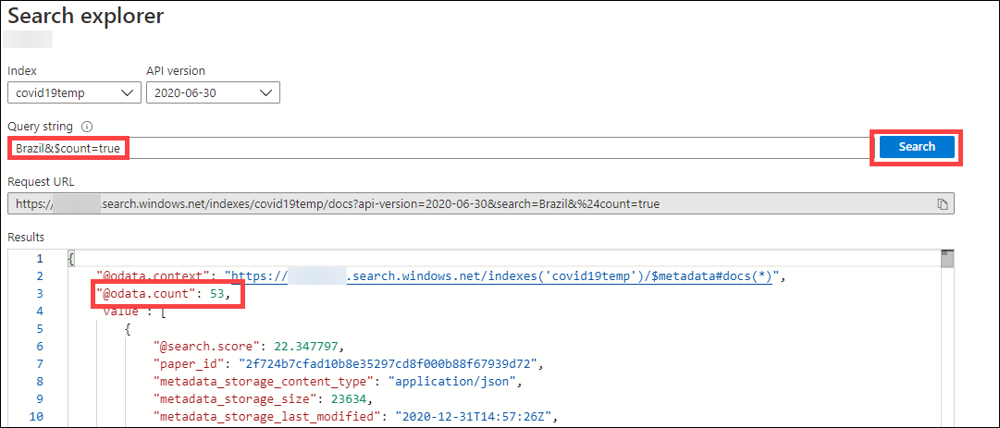

8. Each document returns a large number of fields, but we can specify the fields we would like to see.  In the Query string input box, enter the phrase `UNC Chapel Hill&$select=metadata/authors, metadata/title` and then select **Search**.  This will return the title as well as detailed information on each author.


9. The Azure Search service can also generate a demo application.  Return to the search service and select the **covid19temp** index.

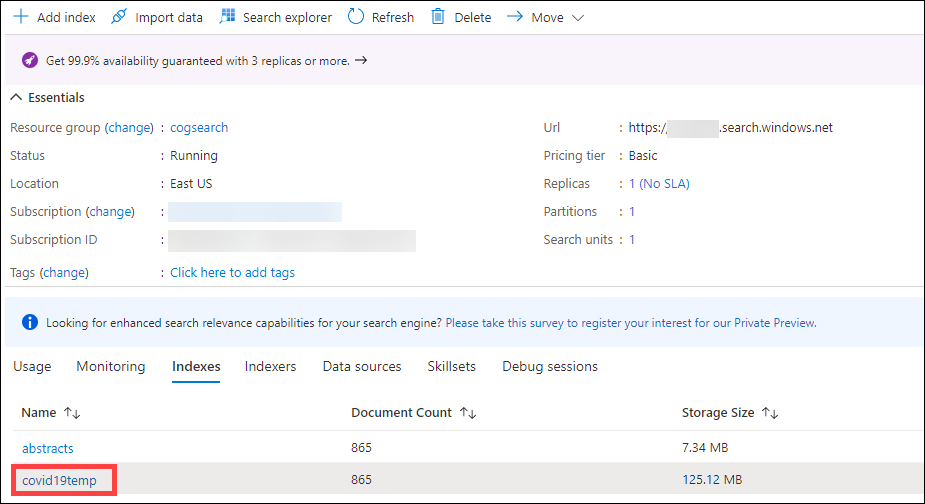

10. Select the **Create Demo App** option.

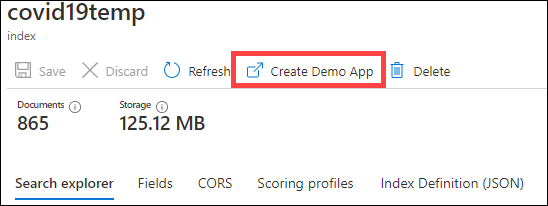

11. On the first tab select `metadata.title` for the Title and `abstract.text` for the Description.  Then select **Create Demo App**.  After the prompt, select **Download** to download an HTML file named `AzSearch.html`.

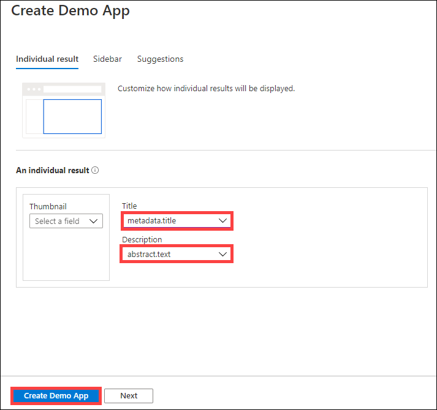

12. Open the demo app HTML file.  In the search box, enter the phrase "RNA interference" and select the Search icon.  This will return 497 papers relating to RNA interference.


## Task 3 - Updating Azure Search Indexes

1. Open Azure Storage Explorer.  Select the **Connect** option and then choose **Use a connection string** and select **Next**.

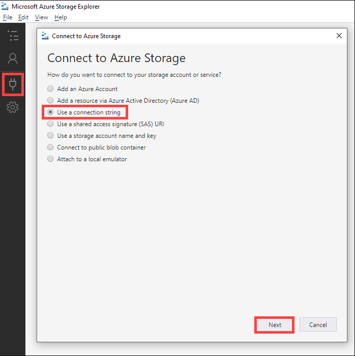

2. Enter **lab04** as the Display name and paste in your storage account connection string.  Then, select **Next** to continue and **Connect** to complete the operation.

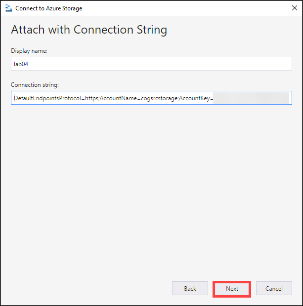

3. In Azure Storage Explorer, navigate down the **lab04** attached storage and select the `covid19temp` blob container.  Double-click the **comm_use_subset** to enter that folder.

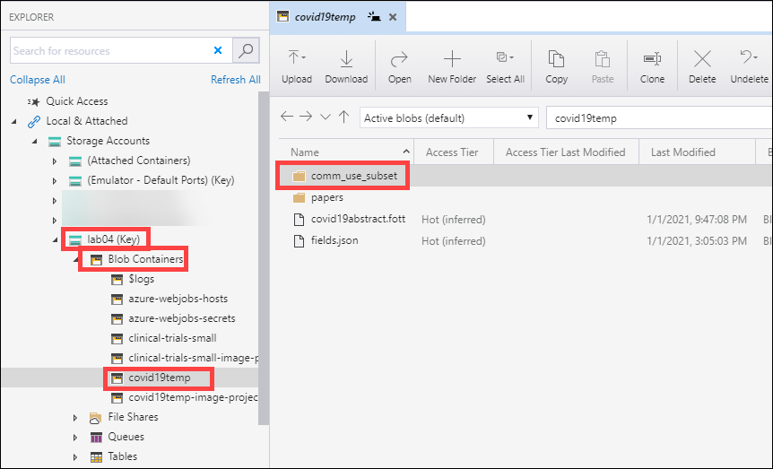

4. Enter the **pdf_json_refresh** folder.  Then, in the **Select All** menu, choose **Select All Cached**.  This will highlight all 100 records in the folder.  Select **Copy** to copy these documents.


5. Navigate up to **comm_use_subset** and then double-click **pdf_json**.  Inside this folder, select **Paste** to paste the 100 documents into the **pdf_json** folder.  When it finishes, you should have 965 total documents.

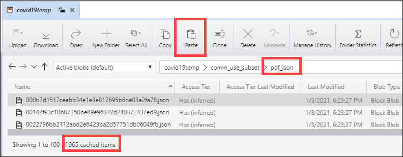

6. Navigate to [the Azure portal](https://portal.azure.com) and log in with your credentials.  Then, select **Resource groups**.


7. Select the **AI-in-a-Day** resource group.

8. Select the Search service.


9. Navigate to the **Indexers** section and select the **covid19temp** indexer.


10. Select the **Run** option to process the 100 documents.  Although we can configure an indexer to run periodically, this indexer will only run when manually engaged.  Select **Yes** to run the indexer.

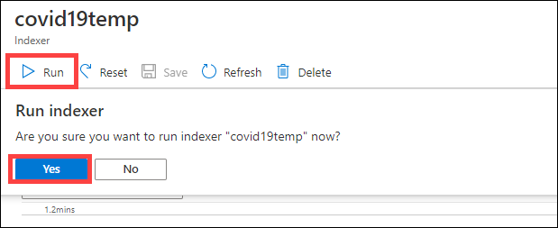

11. The indexer will run.  It should complete within 15-30 seconds to process the 100 new documents.  You may need to select **Refresh** to see the indexer's progress.


12. Return to the **Indexes** tab for the Search service and ensure that the **covid19temp** index has 965 documents.  If it still reads 865, wait 30 seconds and select **Refresh** to check again.


13. Select the **covid19temp** index to return to the Search explorer.  When we had 865 documents, 53 of them pertained to Brazil.  We can confirm that this update was successful by entering `Brazil&$count=true` and selecting **Search**.  This will now return 57 results instead of the prior 53.


