# Lab 5 - Conversational AI with Azure Bot Service and Cognitive Services

With Machine Learning (ML) and Natural Langauge Processing (NLP), Human Machine Interface (HMI) technologies are enjoying an increased adoption year over year. By 2021, [the growth of chatbots in this space is expected to be 25.07%](https://www.technavio.com/report/chatbot-market-industry-analysis). This lab will focus on conversational AI and NLP to help analysts dig into vast amounts of research documents. 

First, we will start with a prepopulate Azure Cognitive Search knowledge base enhanced with Azure Cognitive Services to test our foundational Bot based on old-fashion keyword lookup, regular expressions. Next, we will extend our conversational Bot's behavior using the Bot Framework Composer and Azure Language Understanding (LUIS). Finally, we will deploy our Bot to Azure Bot Service.

## Task 1 - Setting Azure Cognitive Search for a Chatbot

1. Download the starter [Bot project ZIP file](AI-in-a-Day-Bot.zip) to your **Documents** folder. Extract the contents of the ZIP file.

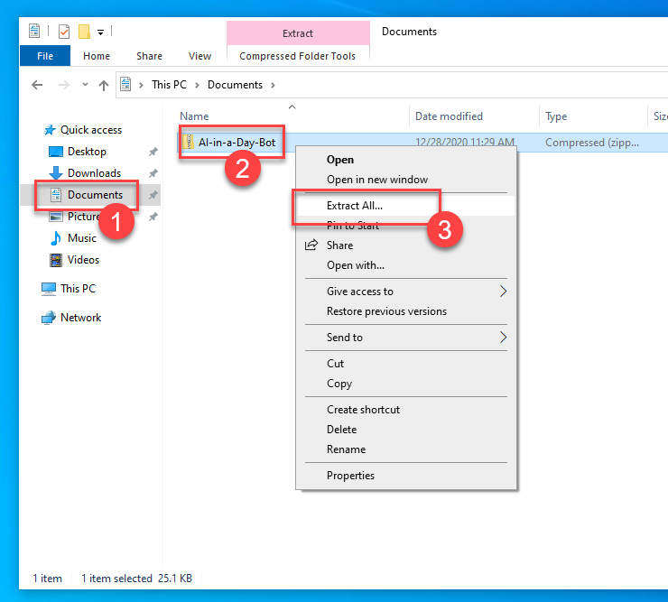

2. Launch the **Bot Framework Composer (1)** from its shortcut on Desktop. Select **Open (2)** to load our starter project.

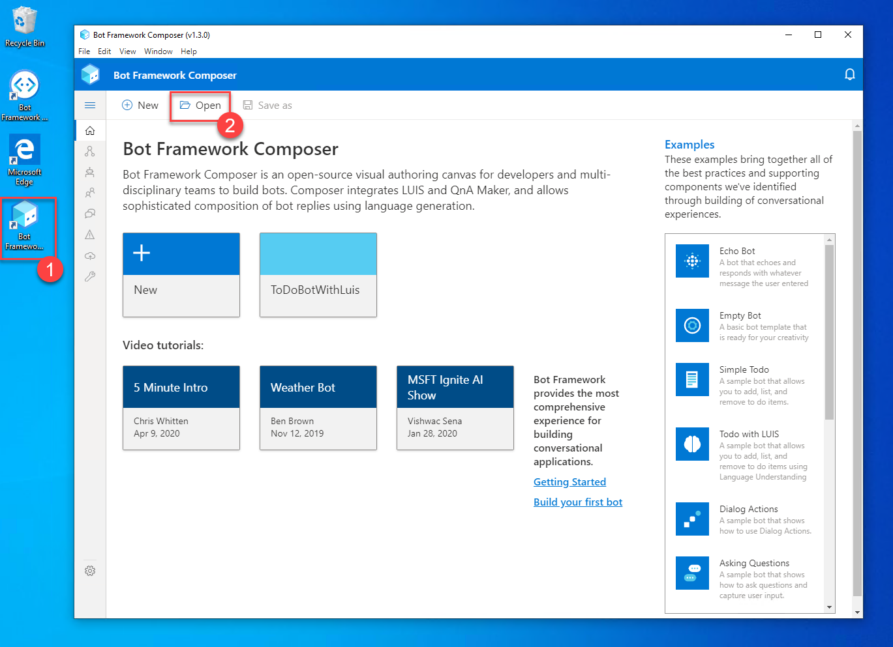

3. Navigate to your **Documents** folder **(1)**. Select the **AI-in-a-Day-Bot** by double clicking **(2)** on it.

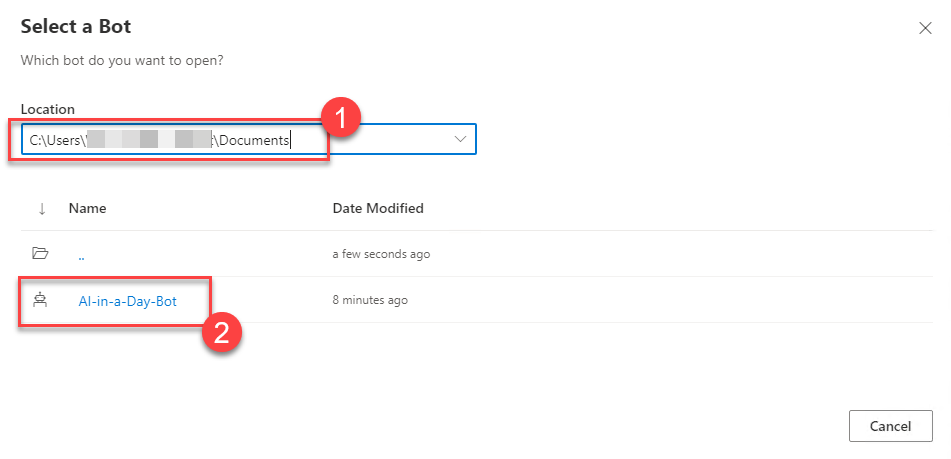

4. In a Microsoft Edge web browser *(Do not close the Bot Framework Composer)*, navigate to the Azure portal (https://portal.azure.com) and login with your credentials. Then select **Resource groups**.


5. Select the **AI-in-a-Day** resource group.

6. Select the Azure Cognitive Search service.

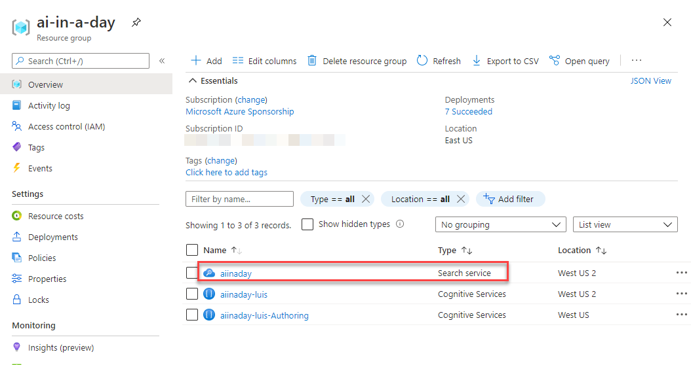

7. Select **Indexes (1)** and observe the number of documents indexed in the **cognitive-index (2)**.

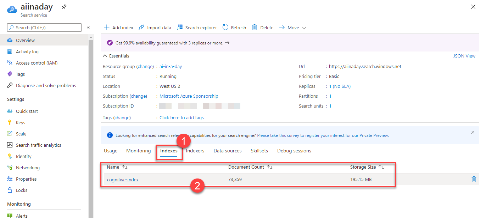

8. Select **Search Explorer** to navigate to a web-based search experience where you can discover the data in the index.


9. Select **Search (1)** to access a sample set of documents from the index. Scroll down and observe the data stored in the index. The values for the fields `people`, `organizations`, `locations`, and `keyphrases`, are created through the use of Azure Cognitive Services as part of the data enrichment process during data indexing.

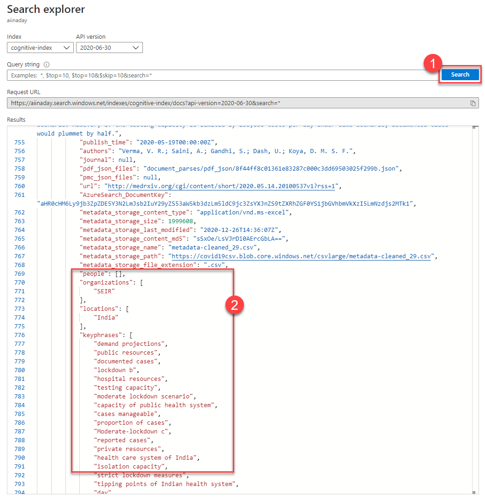

10. Close the **Search Explorer**. Navigate to the **Keys (1)** panel. Copy the primary admin key by selecting the copy command **(2)**.

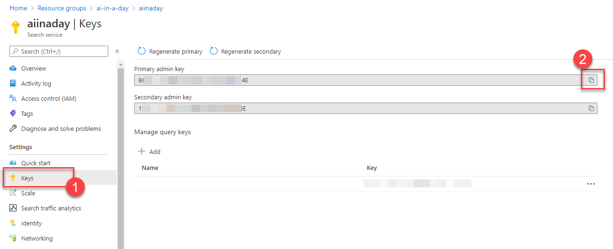

11. Now it's time to change the access keys used in our starter Bot to use our Azure Cognitive Search service. Go back to the Bot Framework Composer. Select **Greeting** trigger **(1)**. From the design, surface select the first **Set a property** activity **(2)**. You will see a **Value** field **(3)** on the right panel. We have to change the value with the primary admin key we have copied from the Azure Portal. 


## Task 2 - Running AI-in-a-Day Conversational Bot for the First Time

1. It is time to start out bot in the local Bot Framework Emulator. Select **Start bot** from the top of the window in the Bot Framework Composer.


2. Once the local bot runtime is ready, a pop-up will appear. Select **Test in Emulator** to start the local Bot Framework Emulator.

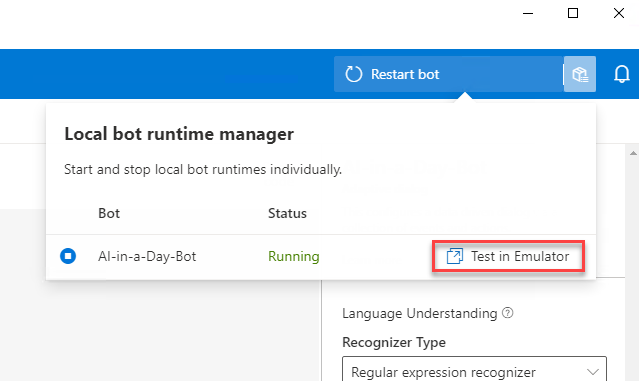

3. Write `What is the latest research?` and observe **(1)** how the bot will respond. You can see the API communication between the emulator and the bot in the list of logs **(2)**.

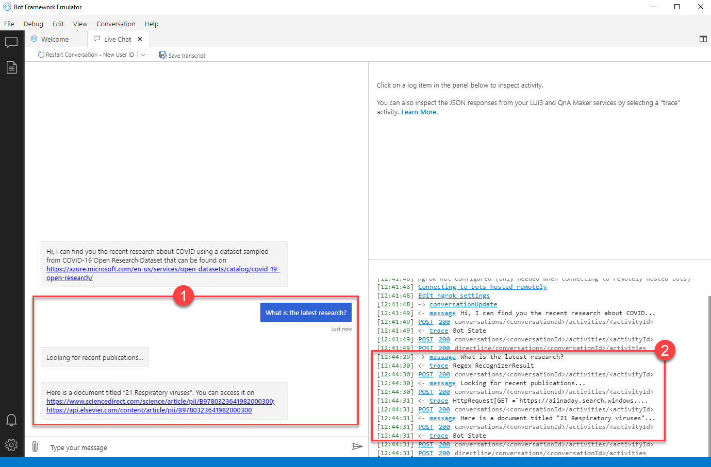

4. Write `Find me publications about SARS` and observe how the bot will respond. 

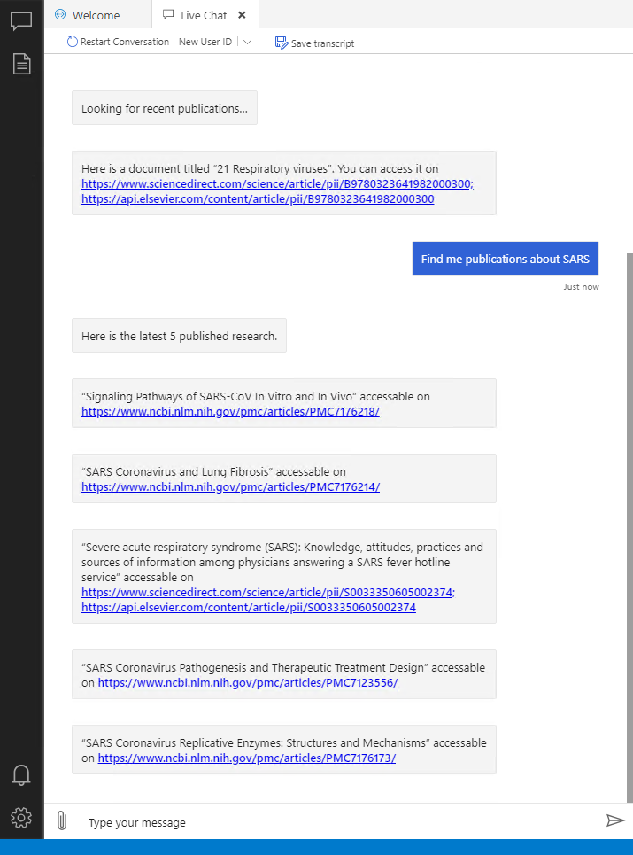

5. Write `More` and observe how the bot will respond. 


6. Write `Find me publications from WHO` and observe how the bot will respond. 

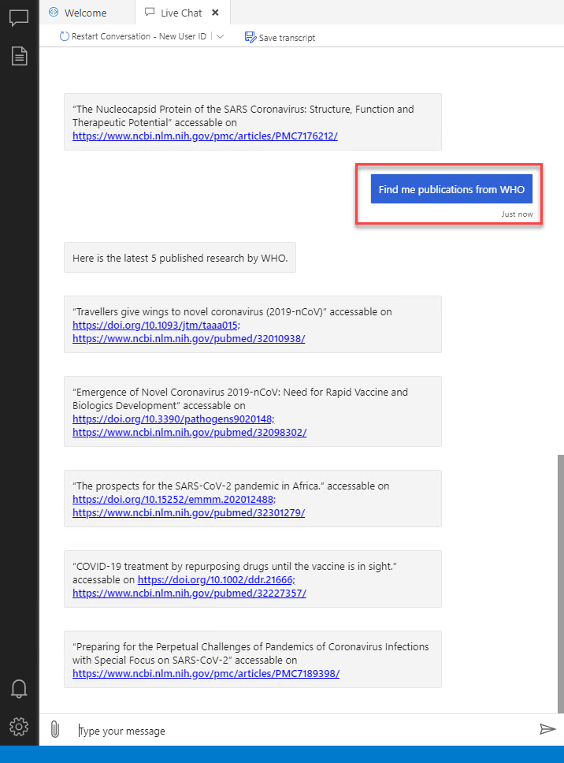

7. Now, let's go back to the **Bot Framework Composer** and see how the bot understands our commands. Select **GetRecentResearch** trigger **(1)** and look at the trigger phrase **(2)**. Our current trigger phrase is set to exactly match what we previously wrote in chat in the Bot Framework Emulator.


8. Switch back to the emulator and write, `What is the latest resarch?`. You will see that our bot can't understand the message anymore. So far, our bot has used **Regular Expression Recognizer** as its Language Understanding engine. The current setup for the **GetRecentResearch** trigger matches only an exact text to detect user intent. A simple typographical error results in a failure.


9. Switch back to the **Bot Framework Composer** and select **ResearchLookup (1)**. Remember, previously, we asked the bot `Find me publications about SARS` to get the latest COVID research related to SARS. You can find the regular expression used to detect the user's intent in the **Trigger Phrases (2)** section. If the user writes anything else, maybe a typographical error, the bot will fail to understand its user's intent. 


10. Feel free to look into the other triggers in the starter project and ask different questions to our bot to test how the different regular expressions set for the current triggers work.

## Task 3 - Extending Our Conversational Bot Using LUIS

Our Bot is now using a **Regular expression recognizer** as its Language Understanding engine. We will extend our Bot with [Azure Language Understanding (LUIS)](https://www.luis.ai/) service. LUIS is a machine learning-based service to build natural language into apps, bots, and IoT devices. LUIS will not only help us build a model but continuously improve as well. 

1. Select **AI-in-a-Day-Bot (1)** under the **Your Project** tree view in the Bot Framework Composer. On the right panel, select **Default Recognizer (2)** instead of **Regular Expression Recognizer** as the Language Understanding engine type. Once set, you will receive an error referring to the missing LUIS keys **(3)**. Select **Fix in bot settings (3)** to navigate to **Project Settings** page.

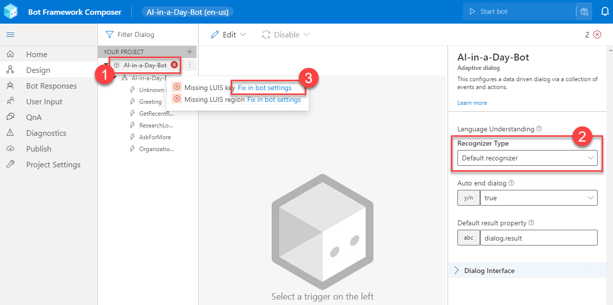

2. In a Microsoft Edge web browser *(Do not close the Bot Framework Composer)*, navigate to the LUIS portal (https://www.luis.ai/) and login with your credentials. Then select your subscription **(1)** and the authoring resource **(2)**. The LUIS authoring resource allows you to create, manage, train, test, and publish your applications. Select **Done (3)** to proceed.

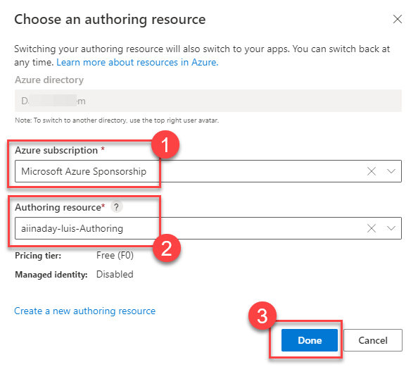

3. Select the **Settings** button from the top blue bar.


4. Select your subscription **(1)** and the authoring resource **(2)**. Drill down through the arrow button **(3)** to access Authoring resource information. Take not of the **Location (4)** and **Primary Key (5)**.

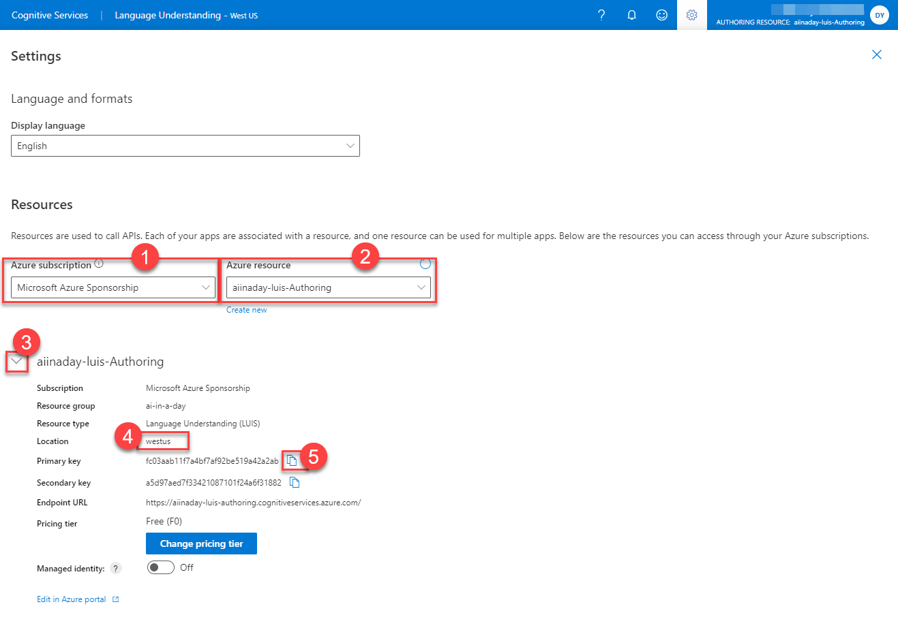

5. Switch back to the Bot Framework Composer. Type in the **primary key** you noted from the previous step into the **LUIS Authoring key** field (1). Select the **location** you noted from the previous step in the **LUIS region** selection list (2). 


6. Switch to the **Design (1)** view. Select **ResearchLookup (2)** trigger. 


7. Copy and paste the below language understanding code with a list of utterances with a single machine-learning entity type definition called `topic` into the **Trigger phrases** box **(3)**. All topic entities below are labeled with values that LUIS will use as part of the machine learning data set. This is a small set of data. We will have the chance to add more later in the lab, on the LUIS portal.

```plaintext
- Find me publications about {topic=SARS}
- Find me research about {topic=SARS}
- Find me research on {topic=SARS}
- Find me publications on {topic=SARS}
- Get me publications about {topic=SARS}
- Get me research about {topic=SARS}
- Get me research on {topic=SARS}
- Get me publications on {topic=SARS}
- Show me publications about {topic=SARS}
- Show me research about {topic=SARS}
- Show me research on {topic=SARS}
- Show me publications on {topic=SARS}
- Find me publications about {topic=ICU}
- Find me research about {topic=ICU}
- Find me research on {topic=ICU}
- Find me publications on {topic=ICU}
- Get me publications about {topic=ICU}
- Get me research about {topic=ICU}
- Get me research on {topic=ICU}
- Get me publications on {topic=ICU}
- Show me publications about {topic=ICU}
- Show me research about {topic=ICU}
- Show me research on {topic=ICU}
- Show me publications on {topic=ICU}
- Find me publications about {topic=Pathogenesis}
- Find me research about {topic=Pathogenesis}
- Find me research on {topic=Pathogenesis}
- Find me publications on {topic=Pathogenesis}
- Get me publications about {topic=Pathogenesis}
- Get me research about {topic=Pathogenesis}
- Get me research on {topic=Pathogenesis}
- Get me publications on {topic=Pathogenesis}
- Show me publications about {topic=Pathogenesis}
- Show me research about {topic=Pathogenesis}
- Show me research on {topic=Pathogenesis}
- Show me publications on {topic=Pathogenesis}
```

8. Type in `#ResearchLookup.Score>=0.6` into the **Condition (4)** box. This will be our prediction scoring setting for the **ResearchLookup** intent.


9. Select **OrganizationBasedSearch (1)** trigger. Copy and paste the below language understanding code into the **Trigger phrases** box **(2)**. Type in `#OrganizationBasedSearch.Score>=0.6` into the **Condition (3)** box. 


```plaintext
- Find me publications from {organization=WHO} 
- Show research from {organization=WHO} 
- What research did {organization=WHO} publish?
- Find me publications from {organization=U.S. CDC}  
- Show research from {organization=U.S. CDC} 
- What research did {organization=U.S. CDC} publish?
- Find me publications from {organization=Institute of Cancer Research} 
- Show research from {organization=Institute of Cancer Research} 
- What research did {organization=Institute of Cancer Research} publish?
```

10. Select **AskForMore (1)** trigger. Type in `-More` into the **Trigger phrases** box **(2)**. Feel free to improve the utterances for this Intent by adding more examples.


11. Now that we have set with all our LUIS intents, entities and labels we can start our bot to test locally in the Bot Framework Emulator.

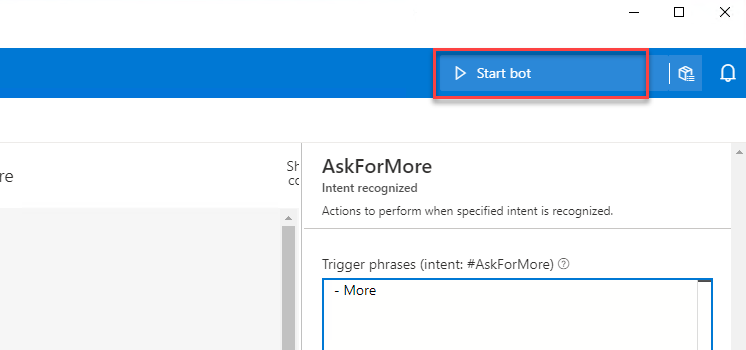

12. What about testing the typographical error that failed with our bot's previous version that did not have LUIS's help? Keep in mind that, for the **GetRecentResearch** intent, we still have a single utterance as shown below.

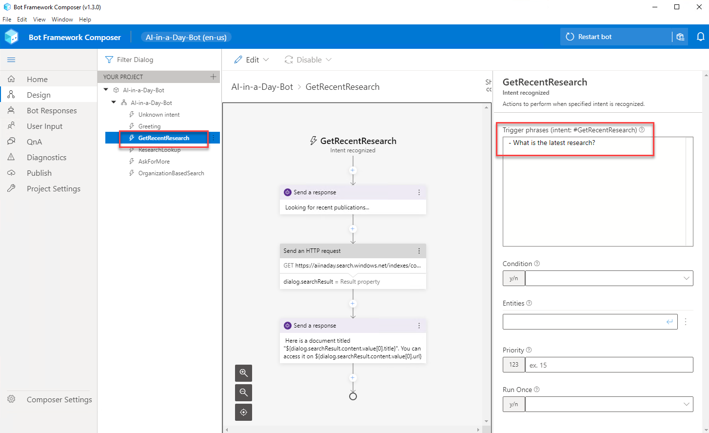

Here we go, type `What is the latest resarch?` and see what happens.

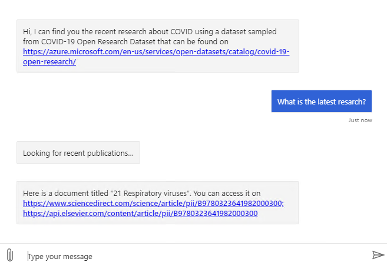

It looks like LUIS was able to understand what we meant without being too picky with typographical errors. 

13. Before we go too far with testing, let's take a look at the LUIS portal to see what happened there. Navigate to [https://www.luis.ai/applications](https://www.luis.ai/applications) in your browser to see a refreshed list of applications. 

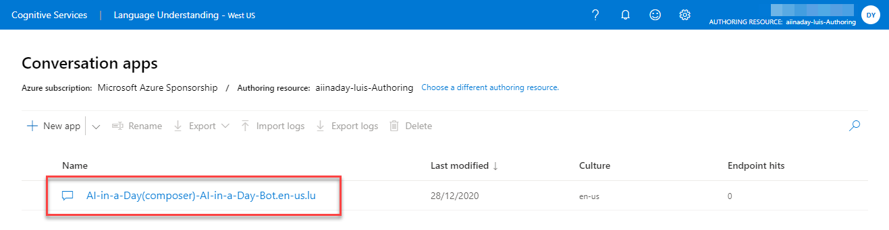

When we started our local bot through Bot Framework Composer, the composer connected to LUIS Authoring service in Azure to set things up for our bot. Our bot is running locally but connecting to the cloud to talk to the LUIS service. 

14. Select the application to see more details.

15. Once you are in the application page you can see a list of **intents** **(2)**. These are the **triggers** we configured in our bot. The number of **examples** **(3)** listed is the number of utterances we provided as **trigger phrases** in the Bot Framework Composer. 

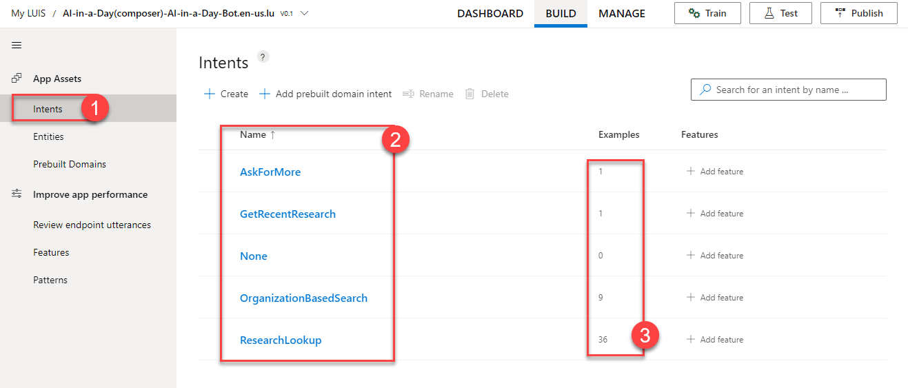

16. Select the **Entities page (1)** in the portal. Observe the list of entities **(2)** and their type listed as machine learned **(3)**.


17. Select the **Review endpoint utterances (1)** page in the portal. This is where we can see a list of utterances users wrote and LUIS predicted, but they are outside the original utterance list we provided. In this case, LUIS did a great job predicting that the `What is the latest resarch?` message was targeting the **GetRecentResearch** intent. We can select the approve this prediction by selecting the **Add** button **(4)**. If LUIS had chosen a wrong intent we could change the aligned intent and give our approval to help LUIS learn and improve its predictions. 

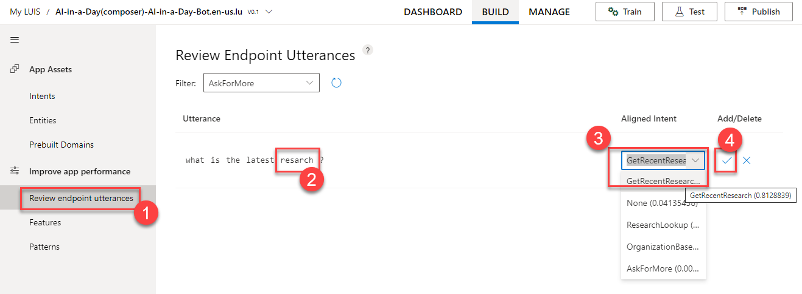

18. Now back to our Bot Emulator for more testing. We will test the **OrganizationBasedSearch** Trigger. As a reminder, here is the list of utterances we provided to LUIS.

```plaintext
- Find me publications from {organization=WHO} 
- Show research from {organization=WHO} 
- What research did {organization=WHO} publish?
- Find me publications from {organization=U.S. CDC}  
- Show research from {organization=U.S. CDC} 
- What research did {organization=U.S. CDC} publish?
- Find me publications from {organization=Institute of Cancer Research} 
- Show research from {organization=Institute of Cancer Research} 
- What research did {organization=Institute of Cancer Research} publish?
```

Let's write `any research from Soochow University?` to mix things up. None of the utterances above is a perfect match to what we are going to try.

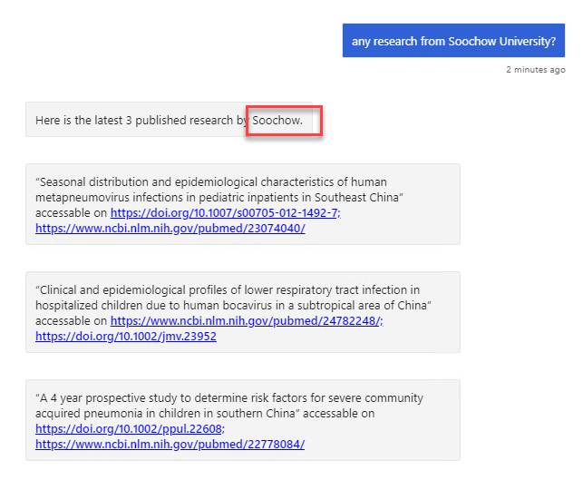

Everything worked fine. It looks like our Bot is in much better shape with the help of LUIS.

## Task 4 - Deploying Our Bot to Azure Bot Service


