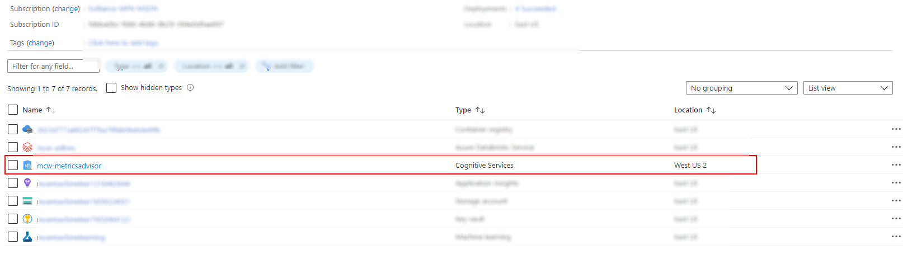
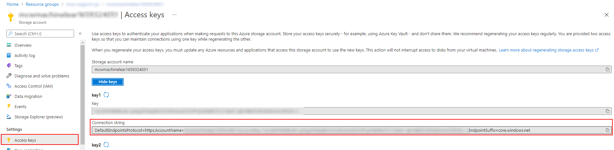
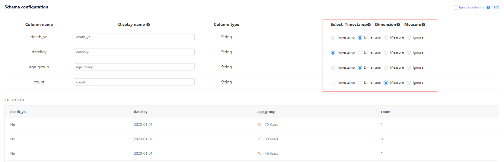
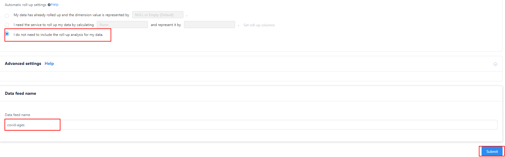
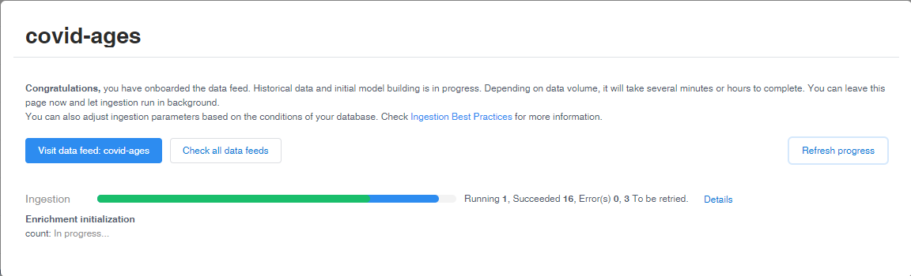

# Lab 6 - Data monitoring and anomaly detection using Metrics Advisor in Azure Cognitive Services

This lab covers the Metrics Advisor service features from Azure Cognitive Services.

## Task 1 - Explore dashboard of COVID-19 data

Understanding the source datasets is very important in AI and ML. To help you expedite the process, we have created a Power BI dashboard you can use to explore them at the begining of each lab.

To get more details about the source datasets, check out the [Data Overview](../data-overview.md) section.

To explore the dashboard of COVID-19 data, open the `Azure-AI-in-a-Day-Data-Overview.pbix` file located on the desktop of the virtual machine provided with your environment.

## Task 2 - Explore lab scenario

Advanced indexing and search work well as long as the corpus of documents contains as little noise as possible. By noise, we identify both issues within documents and whole documents that are not related (or are not close enough, for that matter) to the problem of COVID-19 and its associated domains. In the early stages of document collection, the focus is on the sheer volume (collect as many documents as possible) rather than on quality. However, the system should dismiss documents that are not related to the topics of interest as early as possible.

Using Anomaly Detection and Metrics Advisor, we will demonstrate how to improve the quality of the research document collection process by identifying as early as possible documents that are not related to the problem of COVID-19 and its associated domains.

The following diagram highlights the portion of the general architecture covered by this lab.

The high-level steps covered in the lab are:

- Explore dashboard of COVID-19 data
- Explore the lab scenario
- Identify the concept of anomaly detection in a stream of documents
- Preparing the time series data to feed into the Metrics Advisor
- Onboard your time series data in the Metrics Advisor 
- Tune the anomaly detection configuration 

## Task 3 - Prepare the COVID cases per age group dataset

1. Open the [Azure Machine Learning Studio](https://ml.azure.com) and navigate to the provided pre-created workspace.
   
2. Open the Notebooks section from the left menu.

3. Locate and select the `preparemetricsfeeddata.ipynb` notebook, select a running compute and select the preferred environment to run the notebook from the available `Editors` list (e.g. `Edit in Jupyter`).

4. The notebook will guide you through a list of steps needed to prepare a set of daily JSON files stored in an Azure Blob Storage container that will be used as source of data feed by the Metrics Advisor. Each JSON file will correspond to daily data representing count of COVID positive cases by age group. Open and run the notebook.

5. In Azure portal, go to this lab dedicated resource group, navigate to the blob storage container named `jsonmetrics' and observe the daily data files generated by the notebook.
   
## Task 4 - Start your Azure Metrics Advisor environment

1. Open the [Azure Portal](https://portal.azure.com) and sign-in with your lab credentials.

2. In the list of your recent resources, locate the Azure Metrics Advisor workspace and select it. If you are prompted to sign-in again, use the same lab credentials you used at the previous step.

3. On the Metrics Advisor Quick start page, select the `Go to workspace` link in the first section to start working with the web-based [Metrics Advisor workspace](https://metricsadvisor.azurewebsites.net/).

4. On the Metrics Advisor welcome page, select your Directory, subscription and workspace information and select **Get started**. You are now prepared to create your first Data feed.

## Task 5 - Configure the COVID cases by age group Metrics Advisor data feed 

1. With the Metrics Advidor workspace opened, select the **Add datafeed** option from the left navigation menu.
   
2. Add the data feed by connecting to your time-series data source. Start by selecting the following parameters:
    - **Source type**: `Azure Blob Storage (JSON)`
    - **Granularity**: `Daily`
    - **Ingest data since (UTC)**: `2020-01-01`
    - **Connection string**: provide the connection string from the blob storage access keys page.
  
        

    - **Container**: `jsonmetrics`
    - **Blob template**: `%Y-%m-%d.json` (since the daily json files are provided in with naming format)
    - **JSON format version**: `v2` (since we'll be using the age group dimension in our data schema)

    

3. Select the **Verify and get schema button** to validate the configured connection.  If there's an error at this step, confirm that your connection string and blob template are correct and your Metrics Advisor instance is able to connect to the data source.
   
4. Once the data schema is loaded and shown like below, configure the appropriate fields as Dimension, Measure or Timestamp.
    

5. For **Automatic roll-up ** settings, check the `I do not need to include the roll-up analysis for my data` option. 
   
6. Provide the **data feed name**: `covid-ages`. 
   
7. Select **Submit** to confirm and submit the data feed.

   

8. Wait for the ingestion progress dialog and select the **Details** link in order to observe the ingestion log by timestamp.

  