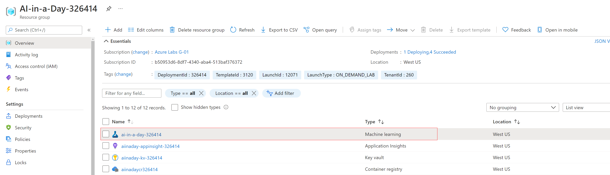
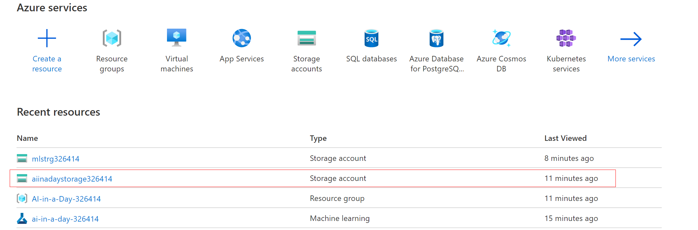
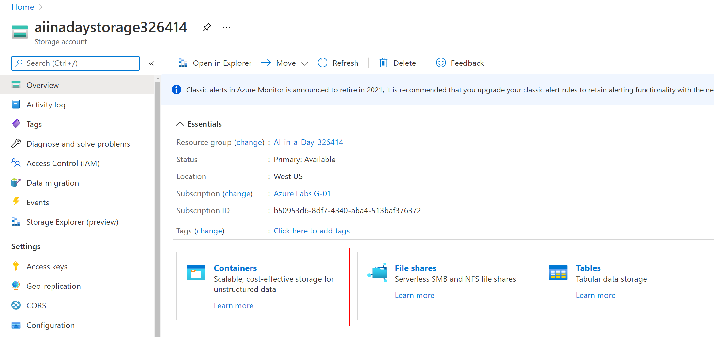
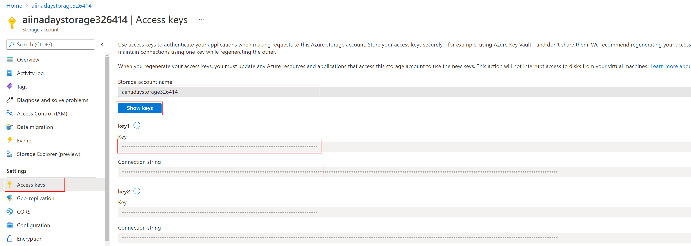
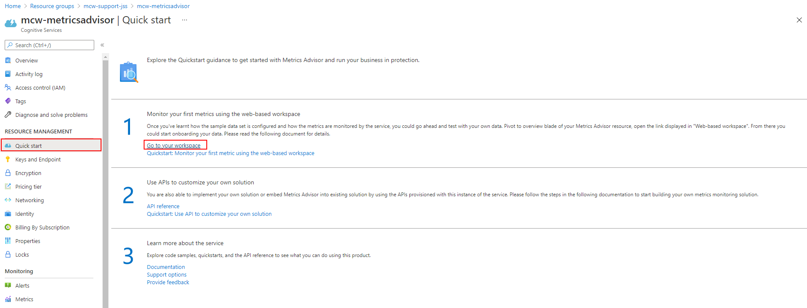
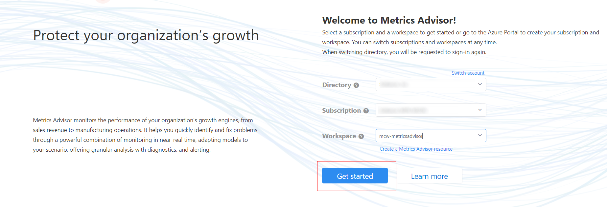
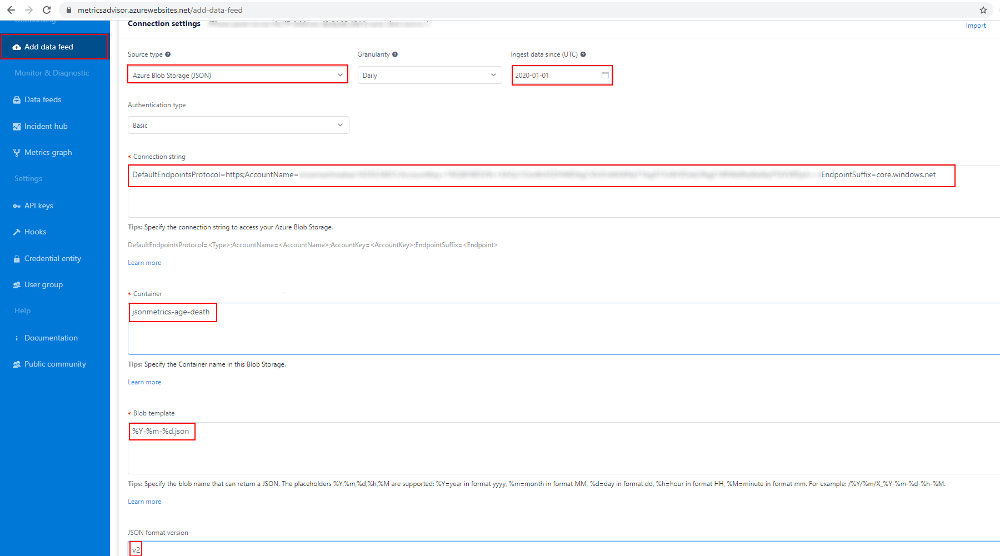
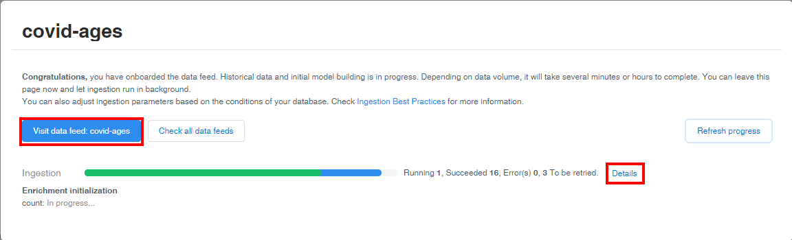
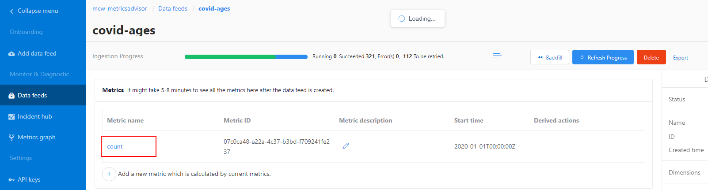
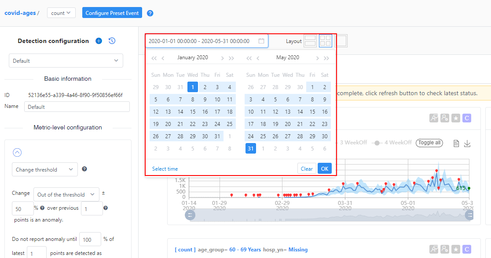

# Lab 6 - Data monitoring and anomaly detection using Metrics Advisor in Azure Cognitive Services

This lab covers the Metrics Advisor service features from Azure Cognitive Services.

## Task 1 - Explore dashboard of COVID-19 data

Understanding the source datasets is very important in AI and ML. To help you expedite the process, we have created a Power BI dashboard you can use to explore them at the begining of each lab.

To get more details about the source datasets, check out the [Data Overview](../data-overview.md) section.

To explore the dashboard of COVID-19 data, open the `Azure-AI-in-a-Day-Data-Overview.pbix` file located on the desktop of the virtual machine provided with your environment.

## Task 2 - Explore lab scenario

Besides collecting data about COVID-19 cases, it is also essential to ensure the accuracy of the reporting. Accuracy check is where continuous monitoring of incoming data feeds doubled by automatic detection of anomalies plays a critical role. Data is valid for analysis as long as it is reliable and contains the minimum possible number of errors. With distributed data sources and numerous reporting entities, automatic anomaly detection is the best choice to minimize that number.

Using Cognitive Services Metrics Advisor, we will demonstrate how to improve the case surveillance data quality by identifying as early as possible anomalies in the number of daily reported cases.

The following diagram highlights the portion of the general architecture covered by this lab.

The high-level steps covered in the lab are:

- Explore dashboard of COVID-19 data
- Explore the lab scenario
- Prepare the cases surveillance time series data to feed into the Metrics Advisor
- Onboard your time series data in the Metrics Advisor
- Tune the anomaly detection configuration

## Task 3 - Prepare Azure Machine Learning workspace

1. Open the [Azure Portal](https://portal.azure.com) and sign-in with your lab credentials.

2. In the list of your recent resources, locate the Azure Machine Learning workspace, select it, and then select `Launch studio`. If you are prompted to sign-in again, use the same lab credentials you used at the previous step.

    

3. In Azure Machine Learning Studio, select `Compute` from the left side menu and verify that your compute instance is running.

    

>Note:
>
>If you launched Azure Machine Learning Studio right after your lab environment was provisioned, you might find the compute instance in a provisioning state. In this case, wait a few minutes until it changes its status to `Running`.

4. From the `Application URI` section associated with the compute instance, select `Jupyter`.

5. In the Jupyter notebook environment, navigate to the folder associated with your lab user. (Note that in some pre-created environments, the user folder is missing when you first access the Jupyter notebook environment, so you can work directly in the root folder where you should find / download the notebooks needed for the lab.)

    

6. If the folder does not contain any notebooks, download the following item to your local machine:

    [Prepare metrics feed data](https://solliancepublicdata.blob.core.windows.net/ai-in-a-day/lab-06/preparemetricsfeeddata.ipynb)

    Upload the file by selecting the `Upload` button from the top right corner of the screen, and then selecting the blue `Upload` button to confirm.

    

7. Once the files is uploaded, return to the Azure Portal and select the storage account named `aiinadaystorageXXXXXX`.

    

8. Select `Containers` and then select `+ Container` to create a new blob storage container.

    

9. Enter `jsonmetrics` as the name, keep all other settings default, and then select `Create` to create the new container.

10. Select `Access keys` from the left side menu, and then select `Show keys`. Save the storage account name, the `key1 Key` value, and the `key1 - Connection string` value for later use.

    

## Task 4 - Prepare the COVID cases per age group dataset

1. With the Azure Machine Learning studio and the Jupyter notebook environment open, select the `preparemetricsfeeddata.ipynb` notebook.

   Make sure you replace the `<BLOBSTORAGE_ACCOUNT_NAME>` and `<BLOBSTORAGE_ACCOUNT_KEY>` values in the variable initialization cell with the values you have noted down at the end of the previous task.

   The notebook will guide you through a list of steps needed to prepare a time series-based dataset containing JSON files to be fed into the Metrics Advisor workspace. Each JSON file will contain daily data representing the count of COVID positive cases by age group.

2. Execute the notebook cell by cell (using either Ctrl + Enter to stay on the same cell, or Shift + Enter to advance to the next cell) and observe the results of each cell execution.

## Task 5 - Configure the COVID cases by age group Metrics Advisor data feed

1. Open the [Azure Portal](https://portal.azure.com) and sign-in with your lab credentials.

2. In the list of your recent resources, locate the Azure Metrics Advisor workspace and select it. If you are prompted to sign-in again, use the same lab Azure credentials you used at the previous step.

3. On the Metrics Advisor Quick start page, select the `Go to workspace` link in the first section to start working with the web-based [Metrics Advisor workspace](https://metricsadvisor.azurewebsites.net/).

    

4. On the Metrics Advisor welcome page, select your Directory, subscription and workspace information and select **Get started**. You are now prepared to create your first Data feed.

    

5. With the Metrics Advisor workspace opened, select the **Add datafeed** option from the left navigation menu.

6. Add the data feed by connecting to your time-series data source. Start by selecting the following parameters:

    - **Source type**: `Azure Blob Storage (JSON)`
    - **Granularity**: `Daily`
    - **Ingest data since (UTC)**: `2020-01-01`
    - **Connection string**: provide the connection string from the blob storage access keys page.
  
        

    - **Container**: `jsonmetrics`
    - **Blob template**: `%Y-%m-%d.json` (since the daily json files are provided in with naming format)
    - **JSON format version**: `v2` (since we'll be using the age group dimension in our data schema)

    

7. Select the **Verify and get schema button** to validate the configured connection.  If there is an error at this step, check that your connection string and blob template are correct and your Metrics Advisor instance is able to connect to the data source.

8. Once the data schema is loaded and shown like below, configure the appropriate fields as Dimension, Measure or Timestamp.

    

9.  Scroll down towards the bottom of the page. For **Automatic roll-up** settings, select the `I do not need to include the roll-up analysis for my data` option.

10. Provide the **Data feed name**: `covid-ages`.

11. Select **Submit** to confirm and submit the data feed.

    

12. Wait for the ingestion progress dialog and select the **Details** link in order to observe the ingestion log by timestamp.

    

13. Select the **Visit data-feed: covid-ages** button to navigate to the data feed overview page.

14. In the data feed page, select the `count` metric under the **Metrics** section.

    

15. To modify the inspected time window, change the start and end time of the interval from the calendar above the graphic representations.

    

16. In the left configuration section, under the **Metric-level configuration** change the default metric-level configuration to mark anomalies when the count value changes to 50% over the previous day count.

    

