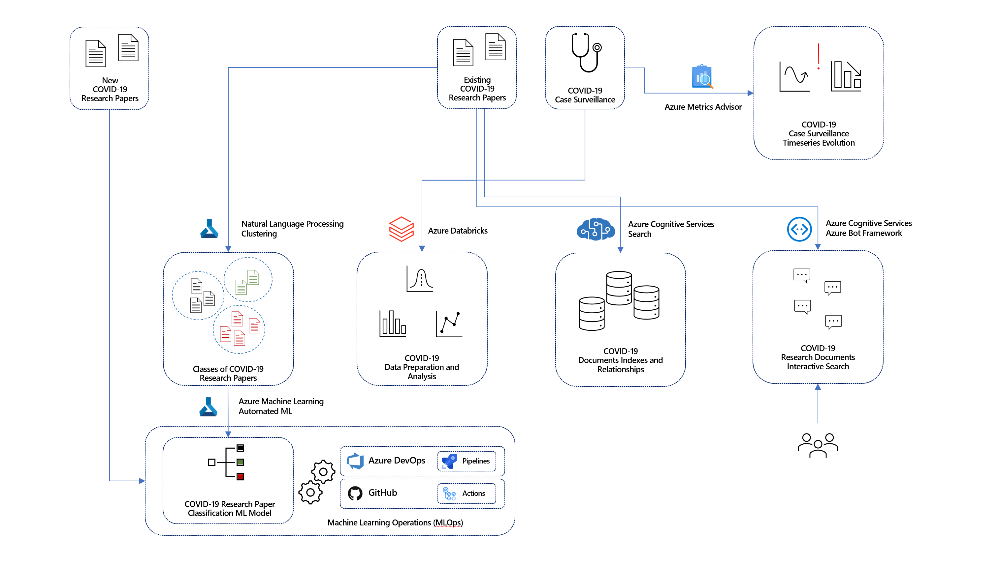

# Azure **AI in a Day** Labs

## Source datasets used by the labs

### COVID-19 Case Surveillance Public Use Data

https://data.cdc.gov/Case-Surveillance/COVID-19-Case-Surveillance-Public-Use-Data/vbim-akqf

The COVID-19 case surveillance system database includes individual-level data reported to U.S. states and autonomous reporting entities, including New York City and the District of Columbia (D.C.), as well as U.S. territories and states. On April 5, 2020, COVID-19 was added to the Nationally Notifiable Condition List and classified as “immediately notifiable, urgent (within 24 hours)” by a Council of State and Territorial Epidemiologists (CSTE) Interim Position Statement (Interim-20-ID-01). CSTE updated the position statement on August 5, 2020 to clarify the interpretation of antigen detection tests and serologic test results within the case classification. The statement also recommended that all states and territories enact laws to make COVID-19 reportable in their jurisdiction, and that jurisdictions conducting surveillance should submit case notifications to CDC. COVID-19 case surveillance data are collected by jurisdictions and shared voluntarily with CDC.

The dataset contains 13.4 million rows of deidentified patient data.

### COVID-19 Open Research Dataset

https://azure.microsoft.com/en-us/services/open-datasets/catalog/covid-19-open-research/

In response to the COVID-19 pandemic, the [Allen Institute for AI](https://allenai.org/) has partnered with leading research groups to prepare and distribute the COVID-19 Open Research Dataset (CORD-19), a free resource of over 47,000 scholarly articles, including over 36,000 with full text, about COVID-19 and the coronavirus family of viruses for use by the global research community. This dataset is made available by the the Allen Institute of AI and [Semantic Scholar](https://pages.semanticscholar.org/coronavirus-research).

This dataset is intended to mobilize researchers to apply recent advances in natural language processing to generate new insights in support of the fight against this infectious disease.

The corpus may be updated as new research is published in peer-reviewed publications and archival services like [bioRxiv](https://www.biorxiv.org/), [medRxiv](https://www.medrxiv.org/), and others.

Understanding the source datasets is very important in AI and ML. To help you expedite the process, we have created a Power BI dashboard you can use to explore them at the begining of each lab.

To get more details about the source datasets, check out the [Data Overview](./data-overview.md) section.

## Background story

Using the data from the datasets described above, we aim to demonstrate how to use AI and ML to enrich various aspects of COVID-19-related data and allow analysts to get the most out of it.

The following diagram provides a high-level overview of the various AI and ML approaches which are applied throughout the labs.

Given the magnitude of the COVID-19 problem, it comes naturally to have a lot of research on the topic. In fact, in 2020 alone, tens of thousands of papers have been published on COVID-19 alone. The sheer amount of communication on the subject makes it difficult for a researcher to grasp and structure all the relevant topics and details. Furthermore, pre-defined catalogs and papers classification might not always reflect their content in the most effective way possible.

Based on a set of existing research papers, we will use Natural Language Processing and Machine Learning to identify these papers' natural grouping. For each new document that gets into our system, we will use Machine Learning to classify it into one of the previously identified groups. We will use Automated ML (a feature of Azure Machine Learning) to train the best classification model and explain its behavior (Lab 1).

Managing a virtually non-stop flux of incoming research documents should be based on a fully automated and traceable process. Everything from data to code must be tracked and monitored. The complex processes of Machine Learning model training and operationalization require secure, end-to-end approaches that allow teams of developers and analysts to iterate through multiple versions of the solution.

Using GitHub and GitHub Actions, we will build an end-to-end Machine Learning process, where data and code act like inputs and actionable REST API endpoints are the result. Our pipelines will automate building and operationalizing the Machine Learning model that classifies research papers (Lab 2).

When data comes in natural language, a data engineering process should transform it into a numerical form useful in Machine Learning. In most cases, some input values will be off (e.g., resulting from human error) or even missing. The same process should be able to identify and handle these cases. Furthermore, analysts need to perform exploratory analysis and various other consistency checks to gain a deep understanding of the data and ensure a level of quality that makes it fit for Machine Learning.

Using Azure Databricks, we will prepare input datasets and analyze their content. We will also attempt to correlate the various datasets and clean their content. We will assess the resulting data quality using both statistical and Machine Learning-based approaches (Lab 6).

Another critical problem to deal with when it comes to the volumes of research documents covering COVID-19 is the problem of advanced indexing and searching their content. The specific internal structure of research papers (including citations, contributors, and various entities like diagnosis, forms of examination, family relations, genes, medication, symptom or signs, and treatments) form a reach semantic graph that goes way beyond simple document categorization. An analyst would benefit significantly from exploring the corpus of documents in a way that takes all these complex relationships into account.

Using the Cognitive Search capabilities, we will create a complex index of documents that allows an analyst to perform an advanced search and explore the inter-document graph relationships (Lab 3).

The power of Machine Learning also comes into play when dealing with human-to-machine interfaces. While classical interfaces like native or web applications are ubiquitous, the new approaches based on conversational AI are becoming increasingly popular. Having the capability to interact with intelligent services using natural language is quickly becoming the norm rather than the exception. Using Conversational AI, analysts can find the research of interest by using simple natural language phrases.

Using Azure Bot Service and Cognitive Services, we provide a conversational bot that helps analysts navigate the corpus of research documents and identify the most relevant ones (Lab 4).

Besides collecting data about COVID-19 cases, it is also essential to ensure the accuracy of the reporting. Accuracy check is where continuous monitoring of incoming data feeds doubled by automatic detection of anomalies plays a critical role. Data is valid for analysis as long as it is reliable and contains the minimum possible number of errors. With distributed data sources and numerous reporting entities, automatic anomaly detection is the best choice to minimize that number.

Using Cognitive Services Metrics Advisor, we will demonstrate how to improve the case surveillance data quality by identifying as early as possible anomalies in the number of daily reported cases (Lab 5).

## Labs

Each individual lab in this repo addresses a subset of the challenges described in the [Background story](#background-story) section.

### Lab 1 - [Azure Machine Learning Model Training](01-aml-model-training/README.md)

The lab covers clustering with Azure Machine Learning, Automated ML, and model explainability.

The high-level steps covered in the lab are:

- Explore dashboard of COVID-19 data
- Explore lab scenario
- Run word embedding process on natural language content of research papers
- Explore results of word embedding
- Run clustering of research papers and explore results
- Use the newly found clusters to label research document and run Auto ML process to train a classifier
- Run the classifier on "new" research papers
- Explain the best model produced by AutoML

### Lab 2 - [Azure Machine Learning - MLOps](02-aml-mlops/README.md)

The lab covers MLOps using Azure DevOps and GitHub, training and deployment of models, real time scoring using a REST API endpoint.

The high-level steps covered in the lab are:

- Explore dashboard of COVID-19 data
- Explore lab scenario
- Overview of CI/CD pipeline
- Perform real time scoring on a REST API endpoint published by the CD component of the pipeline
- Trigger CI/CD pipeline by committing a simple code change
- Monitor execution of CI/CD pipeline all the way to the update on the REST API endpoint
- Perform another real time scoring on the REST API endpoint
- Explore aspects related to traceability and control of the process

### Lab 3 - [Knowledge Mining with Azure Cognitive Search and Text Analytics](03-knowledge-mining/README.md)

This lab covers Azure Cognitive Search (index, knowledge store, custom skills) and Form Recognizer.

The high-level steps covered in the lab are:

- Explore dashboard of COVID-19 data
- Explore lab scenario
- Explore document search process
- Explore graph search process
- Add a set of new documents and trigger the index update process
- Explore the document and graph search and identify updated results

### Lab 4 - [Conversational AI with Azure Bot Service and Cognitive Services](04-conversational-ai/README.md)

This lab covers Azure Bot Service, Bot Framework Composer, and Azure Cognitive Services.

The high-level steps covered in the lab are:

- Explore dashboard of COVID-19 data
- Explore lab scenario
- Interact with the AI-in-a-Day conversational bot
- Extend the behavior of the conversational bot using the Bot Framework Composer (and LUIS)
- Deploy the updated version of the conversational bot
- Interact with improved version of the AI-in-a-Day conversational bot

### Lab 5 - [Metrics Advisor with Azure Cognitive Services](05-metrics-advisor/README.md)

The lab covers the Metrics Advisor service from Azure Cognitive Services.

The high-level steps covered in the lab are:

- Explore dashboard of COVID-19 data
- Explore the lab scenario
- Onboard your time series data in the Metrics Advisor
- Explore anomalies detected in your data
- Perform root cause analysis
- Explore anomalies with hard thresholds (optional)

### Lab 6 - [Machine Learning with Azure Databricks](06-ml-in-databricks/README.md)

The lab covers Data Engineering and Machine Learning using Azure Databricks notebooks.

The high-level steps covered in the lab are:

- Explore dashboard of COVID-19 data
- Explore lab scenario
- Explore source data and identify potential issues
- Perform data cleansing on research paper dataset and explore results
- Perform data cleansing on case surveillance data and explore results
- Correlate research paper and case surveillance datasets
- Use SparkML to build risk classifier on case surveillance dataset
- Assess fairness of risk classifier
