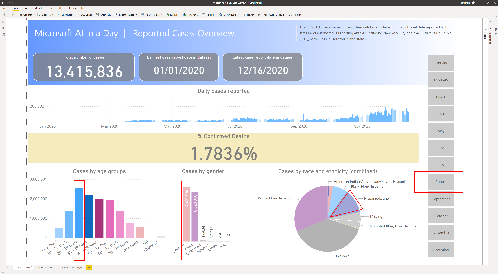
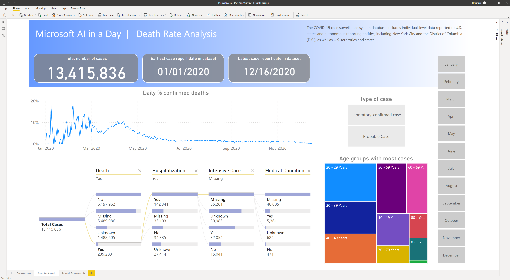
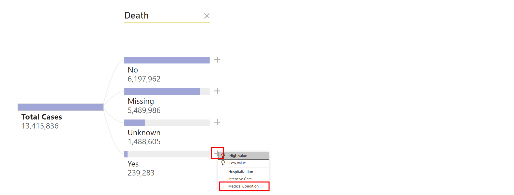
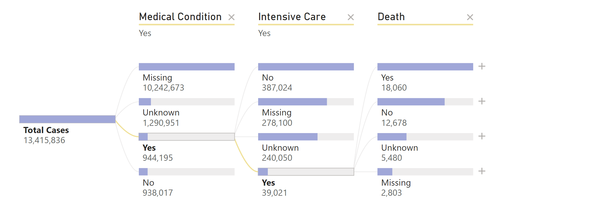
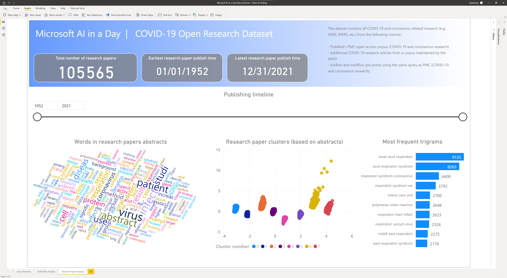

# Azure AI in a Day - Labs data overview

The data used in the labs originates from two datasets:

[**COVID-19 Case Surveillance Public Use Data**](https://data.cdc.gov/Case-Surveillance/COVID-19-Case-Surveillance-Public-Use-Data/vbim-akqf)

The COVID-19 case surveillance system database includes individual-level data reported to U.S. states and autonomous reporting entities, including New York City and the District of Columbia (D.C.), as well as U.S. territories and states. On April 5, 2020, COVID-19 was added to the Nationally Notifiable Condition List and classified as “immediately notifiable, urgent (within 24 hours)” by a Council of State and Territorial Epidemiologists (CSTE) Interim Position Statement (Interim-20-ID-01). CSTE updated the position statement on August 5, 2020 to clarify the interpretation of antigen detection tests and serologic test results within the case classification. The statement also recommended that all states and territories enact laws to make COVID-19 reportable in their jurisdiction, and that jurisdictions conducting surveillance should submit case notifications to CDC. COVID-19 case surveillance data are collected by jurisdictions and shared voluntarily with CDC.

The dataset contains 13.4 million rows of deidentified patient data.

[**COVID-19 Open Research Dataset**](https://azure.microsoft.com/en-us/services/open-datasets/catalog/covid-19-open-research/)

In response to the COVID-19 pandemic, the [Allen Institute for AI](https://allenai.org/) has partnered with leading research groups to prepare and distribute the COVID-19 Open Research Dataset (CORD-19), a free resource of over 47,000 scholarly articles, including over 36,000 with full text, about COVID-19 and the coronavirus family of viruses for use by the global research community. This dataset is made available by the the Allen Institute of AI and [Semantic Scholar](https://pages.semanticscholar.org/coronavirus-research).

This dataset is intended to mobilize researchers to apply recent advances in natural language processing to generate new insights in support of the fight against this infectious disease.

The corpus may be updated as new research is published in peer-reviewed publications and archival services like [bioRxiv](https://www.biorxiv.org/), [medRxiv](https://www.medrxiv.org/), and others.

The **Azure AI in a Day Data Overview** Power BI dashboard provides an overview of the data in the two datasets. It contains the following reports:

- Cases overview: general exploration of the reported cases from **COVID-19 Case Surveillance Public Use Data**
- Intensive Care Unit (ICU) Rate Analysis: detailed analysis of ICU rates from **COVID-19 Case Surveillance Public Use Data**
- Research Papers Analysis: exploration of research paper abstracts from **COVID-19 Open Research Dataset**

To view the reports, open the `Microsoft-AI-in-a-Day-Data-Overview.pbix` file in Power BI Desktop and select the desired report from the tabs located at the bottom of the screen.

## Cases Overview

The default view of the report displays the following information:

- Total number of cases
- Earliest and latest case report dates
- Evolution of daily cases reported
- Percentage of confirmed patients in intensive care units
- Cases by age groups
- Cases by gender
- Cases by race and ethnicity (combined)

Explore the dynamics of the data by slicing through the following elements:

- The month of the year
- The age group
- The gender
- The race and ethnicity (combined) category

Analyze the changes in total number of cases, earliest/latest case report date, evolution of daily cases reported, and percentage of confirmed in intensive care units.

## ICU Rate Analysis

The default view of the report displays the following information:

- Total number of cases
- Earliest and latest case report dates
- Evolution of daily percentage of confirmed ICU cases
- The decomposition of the confirmed ICU cases by hospitalization, intensive care unit, and pre-existing medical conditions
- The age groups with the most confirmed cases

Explore the dynamics of the data by slicing through the following elements:

- The month of the year
- The type of case
- The age group

Analyze the changes in total number of cases, earliest/latest case report date, evolution daily percentage of confirmed ICU cases, decomposition of confirmed ICU cases, and age groups with most cases.

Closing one or more stages of the decomposition tree (by selecting the X on the right of the stage name) allows you to reogranize de decomposition differently to get a different angle of analysis. Select the + sign, and then select the desired stage.

You can also remove the first stage of the decomposition tree (`Hospitalization`) and choose to analyze a different decomposition (e.g. the breakdown on pre-existing medical conditions).

## Research Papers Analysis

The default view of the report displays the following information:

- Total number of research papers
- Earliest and latest paper publish time
- Publishing timeline
- Words in research paper abstracts
- Machine Learning-based grouping of research papers based on their abstracts
- Most frequent trigrams (relevant groups of three consecutive words)

>**Note**
>
>The original text of each paper's abstract has been subject to a process of elimination of stopwords and lemmatization (extraction of the fundamental form of the word). Because of this, the word clouds and the trigrams might appear to have incomplete words. This is expected and is a result of the lemmatization process which is very often used in natural language processing.
>**Note**
>
>Based on the meaning of their abstract, the research papers have been grouped (clustered) into eight distinct grups which where identified dynamically by the Machine Learning algorithm. The documents in each cluster share common aspects. You can explore the differences between clusters by selecting them one by one and observing the changes in the word cloud and the top of most frequent trigrams.
>**Note**
>
>In the central scatter plot, each point represents one research paper. The two-dimensional coordinates have been calculated using a dimensionality reduction process. The actual coordinate values have no specific meaning (except for the fact that they ensure a similar degree of separation between research papers as they have in the higher dimension space that was used to run the clustering Machine Learning algorithm).

Explore the dynamics of the data by slicing through the following elements:

- The publishing timeline
- The words in the word cloud
- The research paper clusters
- The list of most frequent trigrams

Analyze the changes in total number of research papers, earliest/latest paper publish time, word cloud, research paper clusters, and most frequent trigrams.

